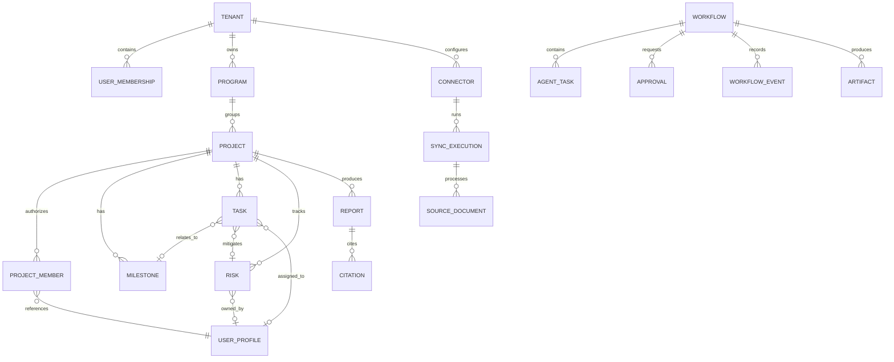
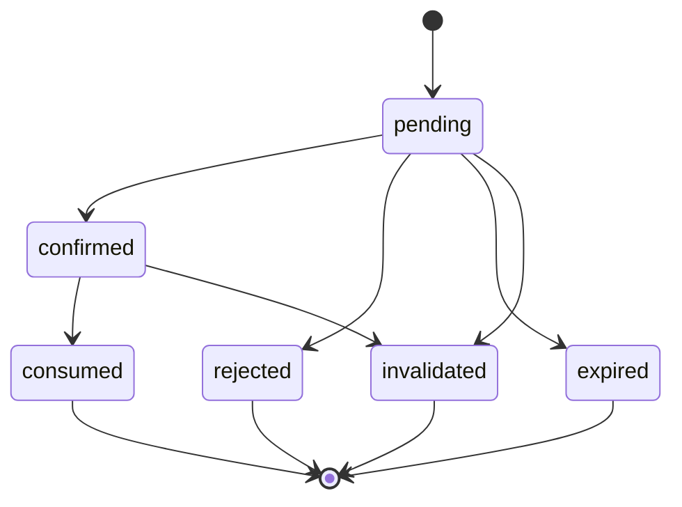

# NPO AI Platform — Data Model

> Tài liệu này định nghĩa logical data model và physical storage model cho NPO AI Platform. Đây là tài liệu đầu vào cho Claude Code khi tạo Pydantic models, DynamoDB repositories, Terraform resources, S3 object conventions, API schemas và test fixtures.

## 1. Phạm vi

Data model hỗ trợ các use case:

- Authentication context và phân quyền theo tenant/project.
- Knowledge Q&A với citations.
- Project, milestone, task và risk management.
- Multi-agent workflow orchestration.
- Dry-run, approval và idempotent mutation.
- Weekly report và artifact management.
- Slack draft/send tracking.
- SharePoint/Slack ingestion và Knowledge Base synchronization.
- Workflow inspection, retry, cancel và audit.

## 2. Nguyên tắc thiết kế

1. Mọi business record phải thuộc một `tenant_id`.
2. Record theo project phải có `project_id` và được truy cập qua tenant/project scope.
3. Không tin `tenant_id`, role hoặc permissions do frontend gửi lên.
4. DynamoDB được thiết kế từ access pattern, không mô phỏng relational database một cách máy móc.
5. Cho phép denormalization có kiểm soát để tránh scan và join phía application.
6. Mutation dùng optimistic concurrency với thuộc tính `version`.
7. Side effect dùng idempotency key và approval binding.
8. File, document body, report lớn và raw payload được lưu trên S3.
9. DynamoDB chỉ lưu metadata, trạng thái, index fields và nội dung nhỏ đã giới hạn.
10. Secret, OAuth token, access token và authorization header chỉ được lưu trong Secrets Manager.
11. Knowledge Base metadata phải đủ để thực hiện tenant/project/role filtering.
12. Không lưu chain-of-thought hoặc hidden model reasoning.
13. Mọi timestamp dùng UTC ISO 8601 trong API và epoch seconds cho DynamoDB TTL.
14. ID được tạo phía server bằng UUIDv7 hoặc ULID để có tính duy nhất và sắp xếp theo thời gian.

## 3. Storage ownership

| Data category | System of record | Ghi chú |
|---|---|---|
| Authentication credentials | Amazon Cognito | Không copy password sang application database |
| User profile và project membership | DynamoDB `BusinessData` | Liên kết với Cognito `sub` |
| Project, milestone, task, risk | DynamoDB `BusinessData` | Business source of truth cho MVP |
| Workflow, task attempt, approval, idempotency | DynamoDB `WorkflowState` | Trạng thái orchestration |
| Raw SharePoint/Slack payload | S3 raw bucket | Immutable/versioned |
| Normalized knowledge documents | S3 curated bucket | Kèm `.metadata.json` |
| Generated reports và artifacts | S3 artifact bucket | DynamoDB lưu metadata và URI |
| Knowledge embeddings/vector index | Bedrock Knowledge Base vector store | Không truy cập trực tiếp từ web |
| OAuth/API secrets | Secrets Manager | DynamoDB chỉ lưu `secret_ref` hoặc connector ID |
| Operational logs/metrics | CloudWatch | Redacted structured events |
| AWS control-plane audit | CloudTrail | Theo retention của tổ chức |

## 4. Naming and common types

### 4.1 Identifier conventions

| Entity | Prefix example |
|---|---|
| Tenant | `ten_01J...` |
| User | Cognito `sub` hoặc internal `usr_01J...` |
| Program | `prg_01J...` |
| Project | `prj_01J...` |
| Milestone | `mil_01J...` |
| Task | `tsk_01J...` |
| Risk | `rsk_01J...` |
| Report | `rpt_01J...` |
| Workflow | `wf_01J...` |
| Agent task | `agt_01J...` |
| Approval | `apr_01J...` |
| Citation | `cit_01J...` |
| Artifact | `art_01J...` |
| Connector | `con_01J...` |
| Sync execution | `syn_01J...` |
| Document | `doc_01J...` hoặc canonical source ID hash |

Prefix là khuyến nghị để debug. Validation không được phụ thuộc vào độ dài prefix nếu sử dụng UUID chuẩn.

### 4.2 Common fields

Business entities nên có:

```json
{
  "entity_type": "TASK",
  "tenant_id": "ten_01J...",
  "created_at": "2026-07-17T10:00:00Z",
  "created_by": "usr_01J...",
  "updated_at": "2026-07-17T10:30:00Z",
  "updated_by": "usr_01J...",
  "version": 3,
  "schema_version": 1
}
```

Quy tắc:

- `created_at` và `created_by` không thay đổi.
- `version` tăng đúng 1 sau mỗi successful mutation.
- `schema_version` phục vụ migration logic, không phải entity revision.
- Không dùng floating-point cho tiền; dùng integer minor units và currency code nếu phase sau cần tài chính.

## 5. Logical entity model



`USER_MEMBERSHIP` biểu diễn membership ở cấp tenant. `PROJECT_MEMBER` biểu diễn quyền cụ thể trên project. Cognito là nguồn xác thực; DynamoDB là nguồn application authorization.

## 6. Entity definitions

### 6.1 Tenant

```json
{
  "tenant_id": "ten_01J...",
  "name": "Green Hope Foundation",
  "slug": "green-hope-foundation",
  "status": "active",
  "default_timezone": "Asia/Bangkok",
  "default_locale": "vi-VN",
  "data_classification_policy": "internal",
  "created_at": "2026-07-17T00:00:00Z",
  "updated_at": "2026-07-17T00:00:00Z",
  "version": 1,
  "schema_version": 1
}
```

Allowed status:

- `active`
- `suspended`
- `archived`

### 6.2 UserProfile

```json
{
  "user_id": "usr_01J...",
  "cognito_sub": "00000000-0000-0000-0000-000000000000",
  "tenant_id": "ten_01J...",
  "email_normalized": "user@example.org",
  "display_name": "Minh Nguyen",
  "status": "active",
  "locale": "vi-VN",
  "timezone": "Asia/Bangkok",
  "last_project_id": "prj_01J...",
  "created_at": "2026-07-17T00:00:00Z",
  "updated_at": "2026-07-17T00:00:00Z",
  "version": 1,
  "schema_version": 1
}
```

Không lưu password, Cognito access token hoặc MFA secret.

### 6.3 TenantMembership

```json
{
  "tenant_id": "ten_01J...",
  "user_id": "usr_01J...",
  "roles": ["npo_staff", "project_manager"],
  "capabilities": [
    "knowledge:read",
    "project:read",
    "task:read",
    "task:write",
    "report:create",
    "slack:draft" 
  ],
  "status": "active",
  "joined_at": "2026-07-17T00:00:00Z",
  "version": 1
}
```

Capabilities có thể được derive từ role và policy. Nếu lưu materialized capabilities, phải có `policy_version` để biết khi nào cần refresh.

### 6.4 Program

```json
{
  "program_id": "prg_01J...",
  "tenant_id": "ten_01J...",
  "name": "Community Resilience",
  "description": "Regional resilience program",
  "status": "active",
  "owner_user_id": "usr_01J...",
  "start_date": "2026-01-01",
  "end_date": "2026-12-31",
  "created_at": "2026-07-17T00:00:00Z",
  "updated_at": "2026-07-17T00:00:00Z",
  "version": 1
}
```

### 6.5 Project

```json
{
  "project_id": "prj_01J...",
  "tenant_id": "ten_01J...",
  "program_id": "prg_01J...",
  "code": "GREEN-HOPE",
  "name": "Green Hope",
  "description": "Community program project",
  "status": "active",
  "health": "amber",
  "manager_user_id": "usr_01J...",
  "start_date": "2026-01-01",
  "end_date": "2026-12-31",
  "tags": ["community", "education"],
  "knowledge_source_ids": ["con_sharepoint_1", "con_slack_1"],
  "created_at": "2026-07-17T00:00:00Z",
  "updated_at": "2026-07-17T00:00:00Z",
  "version": 1,
  "schema_version": 1
}
```

Project status:

- `planned`
- `active`
- `on_hold`
- `completed`
- `archived`

Project health:

- `green`
- `amber`
- `red`
- `unknown`

### 6.6 ProjectMember

```json
{
  "tenant_id": "ten_01J...",
  "project_id": "prj_01J...",
  "user_id": "usr_01J...",
  "project_role": "project_manager",
  "capabilities": [
    "project:read",
    "task:read",
    "task:write",
    "risk:read",
    "report:create"
  ],
  "status": "active",
  "joined_at": "2026-07-17T00:00:00Z",
  "version": 1
}
```

### 6.7 Milestone

```json
{
  "milestone_id": "mil_01J...",
  "tenant_id": "ten_01J...",
  "project_id": "prj_01J...",
  "name": "Training rollout completed",
  "description": "Complete training in all target locations",
  "status": "in_progress",
  "health": "amber",
  "target_date": "2026-09-30",
  "completed_at": null,
  "owner_user_id": "usr_01J...",
  "created_at": "2026-07-17T00:00:00Z",
  "updated_at": "2026-07-17T00:00:00Z",
  "version": 1
}
```

Milestone status:

- `not_started`
- `in_progress`
- `blocked`
- `completed`
- `cancelled`

### 6.8 Task

```json
{
  "task_id": "tsk_01J...",
  "tenant_id": "ten_01J...",
  "project_id": "prj_01J...",
  "milestone_id": "mil_01J...",
  "related_risk_ids": ["rsk_01J..."],
  "title": "Review logistics plan",
  "description": "Review and approve logistics for the training rollout.",
  "status": "in_progress",
  "priority": "high",
  "assignee_user_id": "usr_01J...",
  "created_by": "usr_01J...",
  "due_date": "2026-07-24",
  "completed_at": null,
  "blocked_reason": null,
  "tags": ["logistics"],
  "created_at": "2026-07-17T00:00:00Z",
  "updated_at": "2026-07-17T00:00:00Z",
  "updated_by": "usr_01J...",
  "version": 3,
  "schema_version": 1
}
```

Task status:

- `todo`
- `in_progress`
- `blocked`
- `done`
- `cancelled`

Priority:

- `low`
- `medium`
- `high`
- `critical`

Overdue là derived state:

```text
due_date < organization_today
AND status NOT IN (done, cancelled)
```

Không lưu `is_overdue` như source of truth. Có thể materialize một index field và cập nhật bằng scheduled process nếu cần query hiệu năng cao.

### 6.9 Risk

```json
{
  "risk_id": "rsk_01J...",
  "tenant_id": "ten_01J...",
  "project_id": "prj_01J...",
  "title": "Training materials may arrive late",
  "description": "Supplier delivery date is close to rollout date.",
  "status": "open",
  "category": "delivery",
  "likelihood": 4,
  "impact": 4,
  "score": 16,
  "severity": "high",
  "owner_user_id": "usr_01J...",
  "mitigation": "Use local backup supplier.",
  "review_date": "2026-07-24",
  "source_citation_ids": ["cit_01J..."],
  "created_at": "2026-07-17T00:00:00Z",
  "updated_at": "2026-07-17T00:00:00Z",
  "version": 1
}
```

Risk status:

- `open`
- `mitigating`
- `accepted`
- `closed`

Risk score:

```text
score = likelihood * impact
likelihood and impact are integers from 1 to 5
```

Severity thresholds phải cấu hình được; default:

- 1–4: `low`
- 5–9: `medium`
- 10–16: `high`
- 17–25: `critical`

### 6.10 Report

```json
{
  "report_id": "rpt_01J...",
  "tenant_id": "ten_01J...",
  "project_id": "prj_01J...",
  "workflow_id": "wf_01J...",
  "report_type": "weekly_status",
  "title": "Green Hope Weekly Status — 2026-W29",
  "period_start": "2026-07-13",
  "period_end": "2026-07-19",
  "status": "complete",
  "artifact_id": "art_01J...",
  "artifact_s3_uri": "s3://artifact-bucket/ten_01J/wf_01J/art_01J/report.md",
  "content_type": "text/markdown",
  "content_hash": "sha256:...",
  "citation_ids": ["cit_01J..."],
  "warnings": [],
  "generated_by_agent": "reporting-agent",
  "prompt_version": "reporting-v1",
  "created_at": "2026-07-17T00:00:00Z",
  "created_by": "usr_01J...",
  "version": 1
}
```

Report status:

- `generating`
- `complete`
- `partial`
- `failed`
- `archived`

### 6.11 Citation

```json
{
  "citation_id": "cit_01J...",
  "tenant_id": "ten_01J...",
  "project_id": "prj_01J...",
  "source_system": "sharepoint",
  "connector_id": "con_01J...",
  "document_id": "doc_01J...",
  "canonical_source_id": "sharepoint:site-id:item-id",
  "document_title": "Procurement Policy",
  "source_uri": "https://approved-source.example/item/123",
  "curated_s3_uri": "s3://curated-bucket/ten_01J/prj_01J/sharepoint/doc_01J.txt",
  "page_or_section": "Section 4.2",
  "excerpt": "Approval requires two reviewers.",
  "last_modified_at": "2026-07-10T00:00:00Z",
  "retrieved_at": "2026-07-17T00:00:00Z",
  "content_hash": "sha256:...",
  "classification": "internal"
}
```

Citation có thể được lưu như workflow/report child record. Không bắt buộc tạo global citation record tồn tại vĩnh viễn cho mọi retrieval.

### 6.12 Connector

```json
{
  "connector_id": "con_01J...",
  "tenant_id": "ten_01J...",
  "connector_type": "sharepoint",
  "display_name": "Organization SharePoint",
  "status": "healthy",
  "mode": "live",
  "secret_ref": "npo-ai/dev/connectors/con_01J",
  "allowed_sources": [
    {
      "source_id": "site-id-or-channel-id",
      "project_id": "prj_01J...",
      "display_name": "Green Hope"
    }
  ],
  "schedule_expression": "rate(1 hour)",
  "last_successful_sync_at": "2026-07-17T00:00:00Z",
  "last_attempted_sync_at": "2026-07-17T00:00:00Z",
  "next_sync_at": "2026-07-17T01:00:00Z",
  "created_at": "2026-07-17T00:00:00Z",
  "updated_at": "2026-07-17T00:00:00Z",
  "version": 1
}
```

Connector status:

- `not_configured`
- `authorization_required`
- `healthy`
- `syncing`
- `degraded`
- `failed`
- `disabled`

`secret_ref` không được trả về frontend. API trả một safe connector view.

### 6.13 SyncExecution

```json
{
  "sync_id": "syn_01J...",
  "tenant_id": "ten_01J...",
  "connector_id": "con_01J...",
  "source_id": "site-or-channel-id",
  "status": "completed",
  "mode": "incremental",
  "trigger": "schedule",
  "started_at": "2026-07-17T00:00:00Z",
  "completed_at": "2026-07-17T00:02:00Z",
  "cursor_before": "opaque-provider-cursor",
  "cursor_after": "opaque-provider-cursor-2",
  "items_seen": 100,
  "items_created": 10,
  "items_updated": 5,
  "items_unchanged": 84,
  "items_deleted": 0,
  "items_quarantined": 1,
  "error_summary": [],
  "correlation_id": "corr_01J..."
}
```

Provider cursor có thể nhạy cảm. Chỉ lưu nếu provider cho phép và không chứa access token. Không trả cursor về web.

### 6.14 SourceDocument

```json
{
  "document_id": "doc_01J...",
  "tenant_id": "ten_01J...",
  "project_id": "prj_01J...",
  "connector_id": "con_01J...",
  "source_system": "slack",
  "canonical_source_id": "slack:workspace:channel:thread-ts",
  "source_uri": "https://approved-source.example/...",
  "title": "Slack thread — Logistics update",
  "classification": "internal",
  "allowed_roles": ["npo_staff", "project_manager"],
  "allowed_user_ids": [],
  "raw_s3_uri": "s3://raw-bucket/...",
  "curated_s3_uri": "s3://curated-bucket/...",
  "content_hash": "sha256:...",
  "source_last_modified_at": "2026-07-17T00:00:00Z",
  "ingested_at": "2026-07-17T00:01:00Z",
  "ingestion_status": "indexed",
  "schema_version": 1
}
```

Ingestion status:

- `discovered`
- `raw_stored`
- `normalized`
- `queued_for_indexing`
- `indexed`
- `quarantined`
- `deleted_at_source`
- `retained`

### 6.15 ConversationSession

```json
{
  "session_id": "ses_01J...",
  "tenant_id": "ten_01J...",
  "user_id": "usr_01J...",
  "project_id": "prj_01J...",
  "title": "Green Hope procurement questions",
  "status": "active",
  "last_message_at": "2026-07-17T00:00:00Z",
  "message_count": 4,
  "agentcore_session_id": "runtime-session-id",
  "created_at": "2026-07-17T00:00:00Z",
  "expires_at": 1790000000
}
```

Chỉ lưu message content khi có retention policy rõ ràng. Mặc định lưu request/response summary hoặc encrypted artifact reference, không lưu hidden reasoning.

### 6.16 Workflow

```json
{
  "workflow_id": "wf_01J...",
  "tenant_id": "ten_01J...",
  "user_id": "usr_01J...",
  "project_id": "prj_01J...",
  "session_id": "ses_01J...",
  "request_type": "weekly_report",
  "request_summary": "Create Green Hope weekly report",
  "request_hash": "sha256:...",
  "status": "running",
  "mode": "supervisor",
  "current_phase": "collecting_inputs",
  "plan_version": 1,
  "expected_task_count": 3,
  "completed_task_count": 1,
  "failed_task_count": 0,
  "requires_user_action": false,
  "result_summary": null,
  "report_id": null,
  "error": null,
  "created_at": "2026-07-17T00:00:00Z",
  "started_at": "2026-07-17T00:00:01Z",
  "updated_at": "2026-07-17T00:00:05Z",
  "completed_at": null,
  "expires_at": 1790000000,
  "version": 4,
  "schema_version": 1
}
```

Workflow status:

- `received`
- `authorized`
- `planning`
- `running`
- `waiting_for_user`
- `partial`
- `completed`
- `failed`
- `rejected`
- `cancel_requested`
- `cancelled`
- `expired`

### 6.17 AgentTask

```json
{
  "task_id": "agt_01J...",
  "workflow_id": "wf_01J...",
  "parent_task_id": null,
  "agent_name": "knowledge-agent",
  "intent": "knowledge_search",
  "status": "completed",
  "dependency_task_ids": [],
  "attempt": 1,
  "max_attempts": 2,
  "input_ref": "inline-bounded-or-s3-ref",
  "output_ref": "inline-bounded-or-s3-ref",
  "summary": "Retrieved procurement policy evidence",
  "citation_ids": ["cit_01J..."],
  "retryable": false,
  "started_at": "2026-07-17T00:00:02Z",
  "completed_at": "2026-07-17T00:00:04Z",
  "latency_ms": 2000,
  "model_id": "configured-model-id",
  "prompt_version": "knowledge-v1",
  "input_tokens": 1000,
  "output_tokens": 300,
  "error": null
}
```

Agent task không lưu chain-of-thought. `input_ref` và `output_ref` lưu inline chỉ khi nhỏ, đã redacted và nằm trong giới hạn cấu hình.

### 6.18 WorkflowEvent

```json
{
  "event_id": "evt_01J...",
  "workflow_id": "wf_01J...",
  "event_type": "agent_task_completed",
  "public_message": "Approved sources searched",
  "actor_type": "agent",
  "actor_id": "knowledge-agent",
  "task_id": "agt_01J...",
  "from_status": "running",
  "to_status": "running",
  "safe_metadata": {
    "citation_count": 3
  },
  "created_at": "2026-07-17T00:00:04Z"
}
```

Event type allowlist:

- `workflow_created`
- `authorization_completed`
- `intent_classified`
- `plan_created`
- `agent_task_started`
- `agent_task_completed`
- `agent_task_failed`
- `clarification_requested`
- `clarification_received`
- `approval_requested`
- `approval_confirmed`
- `approval_rejected`
- `tool_invoked`
- `artifact_created`
- `workflow_completed`
- `workflow_failed`
- `workflow_cancel_requested`
- `workflow_cancelled`

### 6.19 Approval

```json
{
  "approval_id": "apr_01J...",
  "workflow_id": "wf_01J...",
  "tenant_id": "ten_01J...",
  "project_id": "prj_01J...",
  "requested_by": "usr_01J...",
  "required_confirmer_user_id": "usr_01J...",
  "action_type": "update_task",
  "action_hash": "sha256:canonical-action-json",
  "action_preview": {
    "entity_id": "tsk_01J...",
    "before": {"due_date": "2026-07-20"},
    "after": {"due_date": "2026-07-24"}
  },
  "entity_version": 3,
  "status": "pending",
  "confirmation_token_hash": "sha256:...",
  "created_at": "2026-07-17T00:00:00Z",
  "expires_at": 1780000000,
  "decided_at": null,
  "decided_by": null
}
```

Approval status:

- `pending`
- `confirmed`
- `rejected`
- `expired`
- `invalidated`
- `consumed`

Chỉ lưu hash của confirmation token. Token phải bind với workflow, user, action hash và expiry.

### 6.20 IdempotencyRecord

```json
{
  "tenant_id": "ten_01J...",
  "user_id": "usr_01J...",
  "idempotency_key": "client-uuid",
  "operation": "commit_task_change",
  "request_hash": "sha256:canonical-request",
  "status": "completed",
  "workflow_id": "wf_01J...",
  "resource_id": "tsk_01J...",
  "response_ref": "bounded-result-or-s3-ref",
  "created_at": "2026-07-17T00:00:00Z",
  "expires_at": 1780000000
}
```

Nếu cùng key nhưng khác request hash, trả `409 idempotency_conflict`.

### 6.21 Artifact

```json
{
  "artifact_id": "art_01J...",
  "tenant_id": "ten_01J...",
  "project_id": "prj_01J...",
  "workflow_id": "wf_01J...",
  "artifact_type": "weekly_report",
  "file_name": "green-hope-weekly-2026-w29.md",
  "content_type": "text/markdown",
  "size_bytes": 12000,
  "s3_uri": "s3://artifact-bucket/ten_01J/wf_01J/art_01J/report.md",
  "content_hash": "sha256:...",
  "classification": "internal",
  "created_at": "2026-07-17T00:00:00Z",
  "expires_at": null
}
```

## 7. DynamoDB physical model

Reference implementation sử dụng hai bảng:

1. `BusinessData`
2. `WorkflowState`

Tên thật phải có prefix project/environment và được Terraform output cho application.

## 8. BusinessData table

### 8.1 Table definition

| Property | Value |
|---|---|
| Partition key | `PK` string |
| Sort key | `SK` string |
| GSI1 partition key | `GSI1PK` string |
| GSI1 sort key | `GSI1SK` string |
| GSI2 partition key | `GSI2PK` string |
| GSI2 sort key | `GSI2SK` string |
| Billing | On-demand for MVP |
| Encryption | KMS |
| PITR | Enabled outside ephemeral tests |
| Streams | Optional; enable when event-driven projections are implemented |

GSI attributes là sparse: item không cần access pattern tương ứng thì không có GSI keys.

### 8.2 Key patterns

| Entity/item | PK | SK |
|---|---|---|
| Tenant | `TENANT#<tenantId>` | `META` |
| Program | `TENANT#<tenantId>` | `PROGRAM#<programId>` |
| User profile | `TENANT#<tenantId>#USER#<userId>` | `PROFILE` |
| Tenant membership | `TENANT#<tenantId>#USER#<userId>` | `MEMBERSHIP` |
| User → project edge | `TENANT#<tenantId>#USER#<userId>` | `PROJECT#<projectId>` |
| Project metadata | `TENANT#<tenantId>#PROJECT#<projectId>` | `META` |
| Project member | `TENANT#<tenantId>#PROJECT#<projectId>` | `MEMBER#<userId>` |
| Milestone | `TENANT#<tenantId>#PROJECT#<projectId>` | `MILESTONE#<milestoneId>` |
| Task | `TENANT#<tenantId>#PROJECT#<projectId>` | `TASK#<taskId>` |
| Risk | `TENANT#<tenantId>#PROJECT#<projectId>` | `RISK#<riskId>` |
| Report metadata | `TENANT#<tenantId>#PROJECT#<projectId>` | `REPORT#<createdAt>#<reportId>` |
| Connector summary | `TENANT#<tenantId>` | `CONNECTOR#<connectorId>` |
| Connector config | `TENANT#<tenantId>#CONNECTOR#<connectorId>` | `CONFIG` |
| Connector checkpoint | `TENANT#<tenantId>#CONNECTOR#<connectorId>` | `CHECKPOINT#<sourceId>` |
| Sync execution | `TENANT#<tenantId>#CONNECTOR#<connectorId>` | `SYNC#<startedAt>#<syncId>` |
| Source document metadata | `TENANT#<tenantId>#CONNECTOR#<connectorId>` | `DOCUMENT#<canonicalHash>` |

### 8.3 GSI patterns

#### GSI1 — User assignment and ownership

Task:

```text
GSI1PK = TENANT#<tenantId>#ASSIGNEE#<userId>
GSI1SK = DUE#<yyyy-mm-dd>#STATUS#<status>#PROJECT#<projectId>#TASK#<taskId>
```

Risk:

```text
GSI1PK = TENANT#<tenantId>#RISK_OWNER#<userId>
GSI1SK = REVIEW#<yyyy-mm-dd>#SEVERITY#<severity>#PROJECT#<projectId>#RISK#<riskId>
```

Project listing by program:

```text
GSI1PK = TENANT#<tenantId>#PROGRAM#<programId>
GSI1SK = PROJECT#<status>#<projectNameNormalized>#<projectId>
```

#### GSI2 — Project entity status views

Task:

```text
GSI2PK = TENANT#<tenantId>#PROJECT#<projectId>#TASK_STATUS#<status>
GSI2SK = DUE#<yyyy-mm-dd>#PRIORITY#<priority>#TASK#<taskId>
```

Risk:

```text
GSI2PK = TENANT#<tenantId>#PROJECT#<projectId>#RISK_STATUS#<status>
GSI2SK = SEVERITY#<severityRank>#REVIEW#<yyyy-mm-dd>#RISK#<riskId>
```

Connector:

```text
GSI2PK = TENANT#<tenantId>#CONNECTOR_STATUS#<status>
GSI2SK = TYPE#<connectorType>#CONNECTOR#<connectorId>
```

`severityRank` phải sort đúng mức nghiêm trọng, ví dụ `01-critical`, `02-high`, `03-medium`, `04-low`.

### 8.4 BusinessData access patterns

| ID | Access pattern | DynamoDB operation |
|---|---|---|
| B01 | Get tenant | GetItem tenant `META` |
| B02 | Get user profile/membership | Query user PK |
| B03 | List projects for user | Query user PK, `begins_with(SK, PROJECT#)` |
| B04 | Get project | GetItem project `META` |
| B05 | List project members | Query project PK, `begins_with(SK, MEMBER#)` |
| B06 | List milestones | Query project PK, `begins_with(SK, MILESTONE#)` |
| B07 | Get task | GetItem project PK + task SK |
| B08 | List all project tasks | Query project PK, `begins_with(SK, TASK#)` |
| B09 | List tasks by status/due | Query GSI2 task-status partition |
| B10 | List my tasks | Query GSI1 assignee partition |
| B11 | List overdue tasks | Query GSI1/GSI2 with due-date upper bound and non-terminal statuses |
| B12 | List risks by status/severity | Query GSI2 risk-status partition |
| B13 | List reports by project | Query project PK, `begins_with(SK, REPORT#)` descending |
| B14 | List connectors | Query tenant PK, `begins_with(SK, CONNECTOR#)` |
| B15 | Get connector config/checkpoints | Query connector PK |
| B16 | List recent sync executions | Query connector PK, reverse order on `SYNC#` |
| B17 | Resolve source document | GetItem by connector PK + canonical hash |

Không dùng `Scan` trong application request path.

### 8.5 Denormalized membership writes

Thêm user vào project cần transactional write:

1. `ProjectMember` dưới project partition.
2. `UserProjectEdge` dưới user partition.

Xóa/disable membership phải cập nhật cả hai record bằng `TransactWriteItems`. Authorization code phải coi `ProjectMember` là canonical và user edge là read projection.

### 8.6 Task conditional update

Pseudo-condition:

```text
ConditionExpression:
  attribute_exists(PK)
  AND attribute_exists(SK)
  AND version = :expected_version

Update:
  SET ...,
      version = version + :one,
      updated_at = :now,
      updated_by = :user_id
```

Nếu condition fail, repository trả `entity_version_conflict`, không tự overwrite.

## 9. WorkflowState table

### 9.1 Table definition

| Property | Value |
|---|---|
| Partition key | `PK` string |
| Sort key | `SK` string |
| GSI1 partition key | `GSI1PK` string |
| GSI1 sort key | `GSI1SK` string |
| TTL | `expires_at` number |
| Billing | On-demand |
| Encryption | KMS |
| PITR | Enabled outside ephemeral tests |
| Streams | Recommended for async workflow projections/notifications |

### 9.2 Workflow partition

| Item | PK | SK |
|---|---|---|
| Workflow metadata | `WORKFLOW#<workflowId>` | `META` |
| Execution plan | `WORKFLOW#<workflowId>` | `PLAN#<planVersion>` |
| Agent task attempt | `WORKFLOW#<workflowId>` | `TASK#<taskId>#ATTEMPT#<nn>` |
| Workflow event | `WORKFLOW#<workflowId>` | `EVENT#<timestamp>#<eventId>` |
| Approval | `WORKFLOW#<workflowId>` | `APPROVAL#<approvalId>` |
| Citation | `WORKFLOW#<workflowId>` | `CITATION#<citationId>` |
| Artifact link | `WORKFLOW#<workflowId>` | `ARTIFACT#<artifactId>` |
| Conversation message | `WORKFLOW#<workflowId>` | `MESSAGE#<sequence>` |

Attempt number phải zero-pad, ví dụ `01`, `02`, để sort đúng.

### 9.3 Lookup and projection items

| Item | PK | SK |
|---|---|---|
| Idempotency record | `IDEMPOTENCY#<tenantId>#<userId>#<keyHash>` | `REQUEST` |
| User workflow projection | `TENANT#<tenantId>#USER#<userId>` | `WORKFLOW#<createdAt>#<workflowId>` |
| Project workflow projection | `TENANT#<tenantId>#PROJECT#<projectId>` | `WORKFLOW#<createdAt>#<workflowId>` |
| Session metadata | `SESSION#<sessionId>` | `META` |
| Session workflow edge | `SESSION#<sessionId>` | `WORKFLOW#<createdAt>#<workflowId>` |

Projection items chứa safe summary để list page không phải fetch toàn bộ workflow partitions. Khi tạo workflow, ghi workflow metadata và projections bằng transaction.

### 9.4 GSI1 — Operational workflow views

Workflow metadata:

```text
GSI1PK = TENANT#<tenantId>#WORKFLOW_STATUS#<status>
GSI1SK = UPDATED#<updatedAt>#WORKFLOW#<workflowId>
```

Approval:

```text
GSI1PK = TENANT#<tenantId>#USER#<requiredConfirmerUserId>#PENDING_APPROVAL
GSI1SK = EXPIRES#<expiresAtPadded>#WORKFLOW#<workflowId>#APPROVAL#<approvalId>
```

Sync/worker operations không được phụ thuộc vào eventually consistent GSI để quyết định authorization hoặc commit. Luôn đọc canonical record trước mutation.

### 9.5 WorkflowState access patterns

| ID | Access pattern | Operation |
|---|---|---|
| W01 | Create workflow exactly once | Transaction: idempotency + metadata + projections + event |
| W02 | Get workflow summary | GetItem workflow `META` |
| W03 | Get workflow detail/timeline | Query workflow partition with bounded pagination |
| W04 | List workflows for user | Query user projection partition |
| W05 | List workflows for project | Query project projection partition |
| W06 | List workflows by status | Query GSI1 status partition |
| W07 | List pending approvals for user | Query GSI1 pending-approval partition |
| W08 | Get agent task attempts | Query workflow partition by task prefix |
| W09 | Resume session | Query session partition |
| W10 | Resolve idempotency request | GetItem idempotency PK |

### 9.6 Workflow transition condition

Canonical workflow update phải kiểm tra trạng thái và version:

```text
ConditionExpression:
  version = :expected_version
  AND #status IN (:allowed_status_1, :allowed_status_2)
```

DynamoDB expression không hỗ trợ SQL-style `IN` trong mọi form update condition như pseudocode trên; repository phải tạo expression hợp lệ từ allowlist cố định. Không nhận raw condition từ model hoặc request.

### 9.7 Workflow creation transaction

Một request mới tối thiểu ghi:

1. Idempotency record với condition `attribute_not_exists(PK)`.
2. Workflow `META`.
3. User workflow projection.
4. Project workflow projection nếu có project.
5. Initial `workflow_created` event.

Nếu idempotency record đã tồn tại:

- Cùng request hash: trả workflow hiện có.
- Khác request hash: trả `409 idempotency_conflict`.

## 10. S3 object model

### 10.1 Buckets

| Bucket purpose | Content |
|---|---|
| Raw | Original SharePoint/Slack payloads |
| Curated | Normalized text và Knowledge Base metadata |
| Artifact | Reports, bounded agent outputs, exports |
| Access logs | S3/API access logs nếu cấu hình riêng |

Bucket names không được hard-code; lấy từ environment configuration.

### 10.2 Raw object key

```text
<tenantId>/<connectorType>/<connectorId>/<sourceId>/<yyyy>/<mm>/<dd>/<canonicalHash>/<sourceVersion>.json
```

Raw object metadata/tags:

- `tenant-id`
- `connector-id`
- `source-system`
- `classification`
- `content-hash`
- `sync-id`

Không đưa email, user name hoặc secret vào object key.

### 10.3 Curated object key

```text
<tenantId>/<projectId>/<sourceSystem>/<documentId>/<contentHash>.txt
<tenantId>/<projectId>/<sourceSystem>/<documentId>/<contentHash>.txt.metadata.json
```

Một content object và metadata object phải có cùng basename theo convention mà Bedrock Knowledge Base data source yêu cầu.

### 10.4 Artifact object key

```text
<tenantId>/<projectId>/<workflowId>/<artifactId>/<fileName>
```

Nếu workflow không có project:

```text
<tenantId>/_tenant/<workflowId>/<artifactId>/<fileName>
```

### 10.5 S3 object manifest

```json
{
  "artifact_id": "art_01J...",
  "tenant_id": "ten_01J...",
  "project_id": "prj_01J...",
  "workflow_id": "wf_01J...",
  "content_type": "text/markdown",
  "content_hash": "sha256:...",
  "classification": "internal",
  "created_at": "2026-07-17T00:00:00Z",
  "schema_version": 1
}
```

## 11. Knowledge Base metadata model

### 11.1 Required metadata

```json
{
  "metadataAttributes": {
    "tenant_id": "ten_01J...",
    "project_id": "prj_01J...",
    "source_system": "sharepoint",
    "connector_id": "con_01J...",
    "document_id": "doc_01J...",
    "canonical_source_id": "sharepoint:site:item",
    "source_uri": "https://approved-source.example/item/123",
    "title": "Procurement Policy",
    "allowed_roles": ["npo_staff", "project_manager"],
    "allowed_user_ids": [],
    "classification": "internal",
    "last_modified_at": "2026-07-10T00:00:00Z",
    "content_hash": "sha256:...",
    "schema_version": 1
  }
}
```

Tên wrapper metadata phải được điều chỉnh theo đúng format Bedrock Knowledge Base hiện hành. Pydantic model nội bộ phải độc lập với provider wrapper.

### 11.2 Retrieval filter model

Application tạo filter từ trusted context:

```json
{
  "tenant_id": "ten_01J...",
  "project_ids": ["prj_01J..."],
  "allowed_roles": ["project_manager"],
  "allowed_user_id": "usr_01J...",
  "allowed_sources": ["sharepoint", "slack"],
  "maximum_classification": "internal"
}
```

Không nhận raw Knowledge Base filter expression từ frontend hoặc model.

### 11.3 Classification order

Default order:

```text
public < internal < confidential < restricted
```

User clearance và document classification phải được map thành allow/deny bằng deterministic policy code.

## 12. API view models

Internal database models không được trả trực tiếp qua API. Tạo các public view models.

### 12.1 CurrentUserView

```json
{
  "user_id": "usr_01J...",
  "display_name": "Minh Nguyen",
  "locale": "vi-VN",
  "timezone": "Asia/Bangkok",
  "roles": ["project_manager"],
  "capabilities": ["project:read", "task:write"],
  "projects": [
    {
      "project_id": "prj_01J...",
      "name": "Green Hope",
      "role": "project_manager"
    }
  ]
}
```

### 12.2 ProjectSummaryView

```json
{
  "project_id": "prj_01J...",
  "name": "Green Hope",
  "program_name": "Community Resilience",
  "status": "active",
  "health": "amber",
  "manager": {
    "user_id": "usr_01J...",
    "display_name": "Minh Nguyen"
  },
  "next_milestone": {
    "name": "Training rollout completed",
    "target_date": "2026-09-30"
  },
  "overdue_task_count": 3,
  "high_risk_count": 2,
  "data_as_of": "2026-07-17T00:00:00Z"
}
```

### 12.3 TaskView

```json
{
  "task_id": "tsk_01J...",
  "project_id": "prj_01J...",
  "title": "Review logistics plan",
  "status": "in_progress",
  "priority": "high",
  "assignee": {
    "user_id": "usr_01J...",
    "display_name": "Minh Nguyen"
  },
  "due_date": "2026-07-24",
  "is_overdue": false,
  "version": 3,
  "updated_at": "2026-07-17T00:00:00Z",
  "allowed_actions": ["edit"]
}
```

`allowed_actions` được derive server-side từ authorization context và entity state.

### 12.4 WorkflowView

```json
{
  "workflow_id": "wf_01J...",
  "status": "waiting_for_user",
  "request_summary": "Update task deadline",
  "project": {
    "project_id": "prj_01J...",
    "name": "Green Hope"
  },
  "current_phase": "approval_required",
  "requires_user_action": true,
  "progress": {
    "completed": 2,
    "total": 3
  },
  "events": [],
  "citations": [],
  "artifacts": [],
  "approval": null,
  "warnings": [],
  "retryable": false,
  "created_at": "2026-07-17T00:00:00Z",
  "updated_at": "2026-07-17T00:00:05Z"
}
```

### 12.5 ConnectorSafeView

```json
{
  "connector_id": "con_01J...",
  "connector_type": "slack",
  "display_name": "Organization Slack",
  "status": "healthy",
  "mode": "live",
  "allowed_source_count": 5,
  "last_successful_sync_at": "2026-07-17T00:00:00Z",
  "next_sync_at": "2026-07-17T01:00:00Z",
  "requires_authorization": false,
  "allowed_actions": ["test", "sync", "edit", "disable"]
}
```

Không có `secret_ref`, cursor hoặc provider token.

## 13. Pagination model

List API response:

```json
{
  "items": [],
  "next_cursor": "opaque-signed-or-encrypted-cursor",
  "has_more": false,
  "data_as_of": "2026-07-17T00:00:00Z"
}
```

Cursor requirements:

- Chứa DynamoDB LastEvaluatedKey theo dạng opaque và integrity-protected.
- Bind với tenant, user/query scope, resource type, filters và expiry.
- Không cho frontend sửa PK/SK để truy cập partition khác.
- Default page size 25; maximum 100.

## 14. Error model

```json
{
  "error": {
    "code": "entity_version_conflict",
    "message": "The task changed before your update was applied.",
    "correlation_id": "corr_01J...",
    "retryable": false,
    "details": {
      "entity_type": "task",
      "current_version": 4
    }
  }
}
```

Error code allowlist:

- `validation_error`
- `unauthenticated`
- `unauthorized`
- `not_found`
- `entity_version_conflict`
- `idempotency_conflict`
- `workflow_state_conflict`
- `approval_expired`
- `approval_invalidated`
- `rate_limited`
- `dependency_unavailable`
- `insufficient_evidence`
- `internal_error`

## 15. Data validation rules

### 15.1 Strings

- Trim leading/trailing whitespace.
- Normalize Unicode where safe.
- Store a separate normalized field for case-insensitive search where needed.
- Apply length limits before model/tool invocation.
- Do not render stored text as raw HTML.

Suggested maximums:

| Field | Maximum |
|---|---:|
| Project name | 200 characters |
| Task title | 300 characters |
| Risk title | 300 characters |
| Description | 10,000 characters |
| Assistant question | 8,000 characters |
| Slack draft | Provider/policy limit, also bounded by application |
| Workflow public message | 500 characters |
| Citation excerpt | 1,500 characters |

### 15.2 Dates

- API accepts ISO 8601.
- Date-only business deadlines use `YYYY-MM-DD` and organization timezone.
- Timestamps use UTC with `Z`.
- Relative date from natural language must be resolved to absolute date and shown before approval.

### 15.3 Enumerations

All enums must be defined once in shared Python package and exported to JSON Schema. Unknown enum values from storage should fail safely or map to `unknown` only where the UI contract supports it.

## 16. Authorization model

### 16.1 RequestContext

```json
{
  "correlation_id": "corr_01J...",
  "tenant_id": "ten_01J...",
  "user_id": "usr_01J...",
  "cognito_sub": "uuid",
  "roles": ["project_manager"],
  "capabilities": ["project:read", "task:write"],
  "authorized_project_ids": ["prj_01J..."],
  "classification_clearance": "internal",
  "session_id": "ses_01J..."
}
```

`RequestContext` chỉ được tạo trong API/auth middleware từ verified identity và server-side membership.

### 16.2 Authorization checks

Mọi repository/tool operation thực hiện:

1. Tenant equality check.
2. Entity belongs to authorized project.
3. Required capability check.
4. Entity status permits operation.
5. Classification/ACL check nếu có knowledge/artifact.
6. Approval validation nếu là side effect.
7. Version/idempotency condition.

## 17. Approval and mutation model

### 17.1 Canonical action payload

Action hash phải được tính từ canonical JSON:

```json
{
  "action_type": "update_task",
  "tenant_id": "ten_01J...",
  "project_id": "prj_01J...",
  "entity_id": "tsk_01J...",
  "expected_version": 3,
  "changes": {
    "assignee_user_id": "usr_01J...",
    "due_date": "2026-07-24"
  }
}
```

Canonicalization phải sort keys, normalize dates/IDs và không chứa UI-only text.

### 17.2 Approval lifecycle



Approval bị invalidated khi:

- Action payload thay đổi.
- Entity version thay đổi.
- User permission thay đổi.
- Target Slack channel/message thay đổi.
- Workflow bị cancel.

## 18. Event and audit model

### 18.1 DomainEvent envelope

```json
{
  "event_id": "evt_01J...",
  "event_type": "task.updated.v1",
  "occurred_at": "2026-07-17T00:00:00Z",
  "tenant_id": "ten_01J...",
  "project_id": "prj_01J...",
  "actor": {
    "actor_type": "user",
    "actor_id": "usr_01J..."
  },
  "correlation_id": "corr_01J...",
  "causation_id": "wf_01J...",
  "entity": {
    "entity_type": "task",
    "entity_id": "tsk_01J...",
    "version": 4
  },
  "safe_changes": {
    "changed_fields": ["assignee_user_id", "due_date"]
  },
  "schema_version": 1
}
```

Không đưa full before/after sensitive content vào general logs. Detailed authorized audit record có thể được lưu riêng theo retention policy.

### 18.2 Event versioning

- Event type kết thúc bằng `.v1`, `.v2` khi thay đổi incompatible schema.
- Consumer phải ignore unknown optional fields.
- Không mutate historical events.

## 19. Retention and deletion

Defaults phải cấu hình theo môi trường và policy tổ chức.

| Data | Suggested default | Deletion behavior |
|---|---|---|
| Active project/task/risk | Life of project + policy period | Archive before deletion |
| Workflow metadata/events | 365 days production, shorter in dev | TTL where allowed |
| Idempotency record | 24–72 hours | TTL |
| Pending approval | 15 minutes–24 hours by action | Expire, then TTL later |
| Conversation session | 30–90 days | TTL and artifact cleanup |
| Raw ingestion payload | 30–90 days or policy | S3 lifecycle |
| Curated knowledge | While source authorized + retention | Delete/update with source policy |
| Reports | Project/donor policy | Archive or lifecycle |
| Quarantine objects | Short review period | S3 lifecycle |
| CloudWatch logs | Environment-specific | Log retention policy |

DynamoDB TTL là asynchronous. Authorization không được dựa vào việc expired item đã bị physical delete; code phải kiểm tra `expires_at`.

## 20. Privacy and sensitive data

### 20.1 Prohibited fields

Không lưu trong DynamoDB/S3 documents/logs trừ khi có yêu cầu và policy riêng:

- Password.
- Cognito token.
- Slack/Microsoft/Google access hoặc refresh token.
- Session cookie.
- Full authorization header.
- Foundation-model hidden reasoning.
- Unnecessary beneficiary personal/sensitive data.

### 20.2 Redaction

Logging layer phải redact keys matching:

```text
authorization
access_token
refresh_token
client_secret
password
cookie
set-cookie
confirmation_token
```

## 21. Pydantic model package

Claude Code phải tạo shared package tương tự:

```text
shared/models/
├── common.py
├── identity.py
├── project.py
├── task.py
├── risk.py
├── report.py
├── citation.py
├── workflow.py
├── approval.py
├── connector.py
├── ingestion.py
├── events.py
├── api.py
└── errors.py
```

Requirements:

- Pydantic v2.
- `extra="forbid"` cho command/tool input.
- JSON Schema generation cho API và Gateway tools.
- Enum dùng `str` values ổn định.
- Serializers cho datetime/date/Decimal.
- Không dùng mutable default.
- Separate `Create`, `Update`, `Stored`, và `View` models.

Ví dụ:

```text
TaskCreateCommand
TaskUpdateProposal
TaskStoredItem
TaskView
TaskListResponse
```

## 22. Repository interfaces

Application code không gọi DynamoDB trực tiếp từ agents.

Required interfaces:

```python
class ProjectRepository(Protocol): ...
class TaskRepository(Protocol): ...
class RiskRepository(Protocol): ...
class ReportRepository(Protocol): ...
class MembershipRepository(Protocol): ...
class ConnectorRepository(Protocol): ...
class WorkflowRepository(Protocol): ...
class ApprovalRepository(Protocol): ...
class IdempotencyRepository(Protocol): ...
class ArtifactRepository(Protocol): ...
```

Repositories chịu trách nhiệm:

- Key construction.
- Serialization/deserialization.
- Conditional expressions.
- Pagination cursor.
- Transaction boundaries.
- Domain error mapping.
- Metrics/tracing.

## 23. Terraform data resources

Terraform phải tạo:

### BusinessData table

- `PK`, `SK`.
- `GSI1PK`, `GSI1SK`.
- `GSI2PK`, `GSI2SK`.
- On-demand billing.
- PITR toggle.
- KMS key.
- Deletion protection in production.
- Tags.

### WorkflowState table

- `PK`, `SK`.
- `GSI1PK`, `GSI1SK`.
- TTL attribute `expires_at`.
- Optional stream.
- On-demand billing.
- PITR toggle.
- KMS key.
- Deletion protection in production.

### S3

- Raw, curated, artifact buckets.
- Block Public Access.
- Versioning.
- Default encryption.
- TLS-only bucket policy.
- Lifecycle rules per Section 19.
- CORS only where browser direct access is explicitly required; default no direct browser write.

## 24. Test fixtures

Tạo fixture tối thiểu:

- 2 tenants để kiểm thử isolation.
- 4 users với roles khác nhau.
- 2 programs.
- 3 projects; ít nhất một project user không được truy cập.
- 3 milestones.
- 12 tasks với đủ status, owner và overdue cases.
- 5 risks với nhiều severity.
- 2 reports: complete và partial.
- 2 connectors: Slack và SharePoint.
- 2 sync executions: completed và degraded.
- 6 knowledge documents, gồm conflict và prompt-injection fixture.
- 5 workflows: running, waiting, completed, partial, failed.
- 2 approvals: pending và expired.
- Idempotency duplicate và conflict cases.

Fixture không được chứa token thật, email thật hoặc dữ liệu beneficiary thật.

## 25. Required automated tests

### Data model tests

- Enum validation.
- Date/time serialization.
- Unknown field rejection cho commands.
- Canonical action hashing.
- Cursor integrity.
- Approval expiry.
- Classification comparison.

### DynamoDB tests

- Key generation cho mọi entity.
- Access pattern B01–B17 và W01–W10.
- User/project membership transaction.
- Task optimistic concurrency conflict.
- Workflow transition conflict.
- Idempotent create and mutation.
- GSI projection correctness.
- Cross-tenant key rejection.
- TTL field type.

### S3/Knowledge tests

- Object key convention.
- Metadata sidecar generation.
- Mandatory ACL metadata.
- Content hash deduplication.
- Quarantine when ACL missing.
- Artifact authorization.

## 26. Migration strategy

### 26.1 Schema evolution

- Mỗi stored item có `schema_version` khi có khả năng thay đổi.
- Reader hỗ trợ current và previous schema version trong migration window.
- Write luôn sử dụng current version.
- Backfill bằng idempotent migration job, không bằng table scan trong request path.

### 26.2 Index changes

- Thêm GSI qua Terraform và theo dõi backfill status trước khi application phụ thuộc vào index.
- Duy trì old read path trong rollout window.
- Không xóa GSI trong cùng release thêm query path thay thế.

### 26.3 Entity rename/removal

- Không đổi PK/SK in-place.
- Dual-write projection mới, backfill, chuyển reads, sau đó ngừng projection cũ.
- Physical deletion chỉ sau verification và retention window.

## 27. Implementation checklist for Claude Code

1. Tạo Pydantic models và enums trong shared package.
2. Tạo key builder duy nhất cho mỗi DynamoDB table.
3. Tạo serializers không bỏ qua `Decimal`, datetime và optional fields.
4. Tạo repository interfaces và DynamoDB implementations.
5. Tạo in-memory implementations cho unit tests.
6. Tạo JSON Schemas cho agent/tool/API contracts.
7. Tạo Terraform cho hai tables, GSIs, TTL, PITR và KMS.
8. Tạo S3 buckets, policies và lifecycle rules.
9. Tạo canonical action hashing và confirmation token hashing.
10. Tạo opaque pagination cursor codec.
11. Tạo transactions cho workflow creation, membership và confirmed task mutation.
12. Tạo fixtures và tests trong Sections 24–25.
13. Tạo migration runner với dry-run, checkpoint và idempotency.
14. Tạo documentation cho mọi access pattern.

## 28. Definition of done

Data model hoàn thành khi:

1. Mọi web user flow có entity và access pattern tương ứng.
2. Không request path nào cần DynamoDB Scan.
3. User-to-project authorization có thể resolve bằng bounded reads.
4. Task mutation hỗ trợ preview, approval, idempotency và optimistic locking.
5. Workflow detail, timeline, pending approvals và retry lineage có thể query hiệu quả.
6. SharePoint/Slack ingestion có connector, checkpoint, sync và document metadata models.
7. S3 curated documents có metadata cần thiết cho Knowledge Base filtering.
8. Public API models không làm lộ internal keys, secrets hoặc provider cursors.
9. Terraform tạo đúng tables, indexes, TTL, encryption và protection settings.
10. Unit/integration tests xác nhận cross-tenant isolation và critical access patterns.

