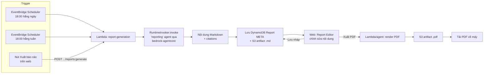

# Đặc tả xuất báo cáo — API và giao diện

> Đặc tả tính năng "Xuất báo cáo" nằm trong tab **Xuất báo cáo** của trang Chi tiết dự án (xem [PROJECT-DETAIL-CONSOLIDATION-PLAN.md](PROJECT-DETAIL-CONSOLIDATION-PLAN.md)). Yêu cầu: nội dung báo cáo do AWS Bedrock AgentCore sinh ra, hiển thị dạng có thể chỉnh sửa trên web, tải về PDF, chạy theo lịch 18:00 hằng ngày và 18:00 hằng tuần, và có nút xuất thủ công.

## 1. Tóm tắt yêu cầu

1. Sinh nội dung báo cáo bằng cách gọi AWS Bedrock AgentCore (agent "reporting" đã có sẵn).
2. Kết quả hiển thị trên web ở dạng **chỉnh sửa được** (không chỉ xem), sau đó cho phép **tải về PDF**.
3. Lập lịch tự động:
   - Báo cáo **hằng ngày**: 18:00 mỗi ngày.
   - Báo cáo **hằng tuần**: 18:00 vào một ngày cố định trong tuần.
   - Nếu hai lịch trùng thời điểm (ví dụ 18:00 Chủ nhật vừa là mốc ngày vừa là mốc tuần), **sinh cả hai báo cáo**, không bỏ lỡ cái nào — vì đây là hai báo cáo khác nhau (một tóm tắt ngày, một tóm tắt tuần).
4. Có nút "Xuất báo cáo" để người dùng chạy thủ công bất cứ lúc nào (không cần chờ lịch), chọn loại báo cáo muốn xuất.

## 2. Hiện trạng liên quan trong repo

- Agent sinh báo cáo đã có: `agents/reporting/agent.py` — `REPORT_GENERATORS` hỗ trợ `weekly_status`, `risk_summary`, `progress_summary`, sinh Markdown từ dữ liệu task/risk/milestone thật (không bịa số liệu), có tool `store_report` lưu vào S3.
- Gọi AgentCore runtime đã có sẵn cơ chế: `agents/common/clients/agentcore.py` (`RuntimeInvoker.invoke(agent_name, request)`) — dùng `boto3` client `bedrock-agentcore`, method `invoke_agent_runtime`, ARN runtime resolve theo tên qua `bedrock-agentcore-control`. Đây chính là con đường gọi "reporting" agent.
- Endpoint hiện tại `GET /v1/reports/{report_id}` (`lambdas/api/handler.py:324`, `handle_get_report`) **chỉ là stub trả dữ liệu giả** — cần thay bằng implementation thật.
- Model `Report` đã có trong `shared/models` và `data-model.md` mục 6.10 (`report_id`, `project_id`, `report_type`, `period_start/end`, `status`, `artifact_s3_uri`, `citation_ids`...) — sẽ mở rộng thêm field cho khả năng chỉnh sửa/PDF (mục 4).
- Có 1 file biên dịch mồ côi `lambdas/scheduled/generate_daily_reports.cpython-313.pyc` không có source `.py` tương ứng trong repo — cho thấy trước đây đã có ý định làm lambda lập lịch sinh báo cáo hằng ngày nhưng chưa merge/đã mất source. Tài liệu này viết lại từ đầu, coi như chưa có gì.
- Chưa có EventBridge Scheduler nào cho báo cáo; module `infra/modules/ingestion/main.tf` dùng `aws_scheduler_schedule` cho đồng bộ SharePoint/Slack — dùng làm khuôn mẫu cho lịch báo cáo.
- Chưa có thư viện PDF nào được khai báo trong `pyproject.toml`; `weasyprint` có sẵn trong `.venv/bin` (dependency bắc cầu của thứ khác) — có thể tận dụng, xem mục 8.

## 3. Kiến trúc tổng quan



## 4. Mở rộng data model

Mở rộng entity `Report` (`data-model.md` mục 6.10) thay vì tạo bảng mới — vẫn dùng bảng `BusinessData`, key pattern có sẵn `TENANT#<tenantId>#PROJECT#<projectId>` / `REPORT#<createdAt>#<reportId>`.

```json
{
  "report_id": "rpt_01J...",
  "tenant_id": "ten_01J...",
  "project_id": "prj_01J...",
  "workflow_id": "wf_01J...",
  "report_type": "daily_update",
  "period_start": "2026-07-18",
  "period_end": "2026-07-18",
  "status": "draft",
  "generated_by": "schedule",
  "schedule_kind": "daily",
  "content_markdown": "# Cập nhật ngày 18/07...",
  "content_ai_original_s3_uri": "s3://artifact-bucket/.../original.md",
  "is_edited": false,
  "edited_by": null,
  "edited_at": null,
  "pdf_artifact_id": null,
  "pdf_s3_uri": null,
  "pdf_generated_at": null,
  "citation_ids": ["cit_01J..."],
  "warnings": [],
  "created_at": "2026-07-18T11:00:00Z",
  "version": 1
}
```

Thay đổi so với model gốc:

| Field mới | Ý nghĩa |
|---|---|
| `report_type` | Thêm 2 giá trị mới vào enum: `daily_update`, `weekly_update` (giữ nguyên `weekly_status`, `risk_summary`, `progress_summary` đã có) |
| `generated_by` | `schedule` \| `manual` — phân biệt nguồn kích hoạt |
| `schedule_kind` | `daily` \| `weekly` \| `null` (null nếu `generated_by=manual` và không map lịch nào) |
| `content_markdown` | Nội dung **hiện tại** (bản người dùng đang xem/sửa) — đây là bản Web đọc/ghi trực tiếp |
| `content_ai_original_s3_uri` | Bản gốc AI sinh ra, giữ nguyên để có thể "Khôi phục bản gốc" |
| `is_edited`, `edited_by`, `edited_at` | Theo dõi việc chỉnh sửa thủ công |
| `pdf_artifact_id`, `pdf_s3_uri`, `pdf_generated_at` | Trạng thái/đường dẫn bản PDF đã xuất (null nếu chưa xuất) |

`status` enum mở rộng: `generating` → `draft` (AI xong, chưa sửa) → `edited` (người dùng đã lưu thay đổi) → `exported` (đã có PDF) → `failed`.

S3 object key cho PDF theo đúng convention artifact đã có (`data-model.md` mục 10.4):

```text
<tenantId>/<projectId>/<workflowId>/<artifactId>/<fileName>.pdf
```

## 5. API endpoints

Bổ sung vào `docs/api.md`, theo đúng phong cách REST hiện có (`/v1/projects/{projectId}/...`).

### 5.1 Tạo báo cáo (thủ công hoặc do lịch gọi nội bộ)

```
POST /v1/projects/{projectId}/reports:generate
```

Request:
```json
{
  "report_types": ["daily_update", "weekly_update"],
  "period_start": "2026-07-18",
  "period_end": "2026-07-18",
  "trigger": "manual",
  "idempotency_key": "unique-key-123"
}
```

- `report_types` là mảng vì nút xuất thủ công cho phép chọn xuất cả ngày lẫn tuần cùng lúc (giống hành vi khi lịch trùng thời điểm — mục 6).
- `trigger`: `manual` (từ nút bấm) hoặc `schedule` (Lambda lập lịch gọi nội bộ, không qua API Gateway public — gọi thẳng use-case layer).
- Response `202 Accepted`, mỗi report type trả một `workflow_id` riêng (tái dùng cơ chế `POST /v1/workflows` đã có, không tạo luồng async mới):

```json
{
  "workflows": [
    { "report_type": "daily_update", "workflow_id": "wf_a1", "status": "queued" },
    { "report_type": "weekly_update", "workflow_id": "wf_a2", "status": "queued" }
  ]
}
```

- Poll tiến độ bằng `GET /v1/workflows/{workflow_id}` đã có sẵn; khi `status=completed`, `report_id` xuất hiện trong response (field `report_id` bổ sung vào `WorkflowView`, `data-model.md` mục 12.4).

### 5.2 Danh sách báo cáo của một dự án

```
GET /v1/projects/{projectId}/reports?report_type=daily_update&period_start=...&period_end=...
```

Response theo pagination model chuẩn (`data-model.md` mục 13):
```json
{
  "items": [
    { "report_id": "rpt_01J...", "report_type": "weekly_update", "period_start": "2026-07-13",
      "period_end": "2026-07-19", "status": "edited", "generated_by": "schedule",
      "created_at": "...", "edited_at": "..." }
  ],
  "next_cursor": null, "has_more": false, "data_as_of": "..."
}
```

### 5.2b Danh sách báo cáo tuần của tất cả dự án (cho trang tổng hợp `/reports/weekly`)

```
GET /v1/reports?report_type=weekly_update&period_start=...&period_end=...
```

- Không có `{projectId}` trong path — trả về báo cáo tuần **mới nhất của mọi dự án** mà người dùng có quyền xem (tenant-scoped, lọc theo `authorized_project_ids` trong `RequestContext`, `data-model.md` mục 16.1), mỗi item kèm `project_id`/`project_name` để trang tổng hợp render danh sách dự án + trạng thái báo cáo tuần, không cần gọi lặp lại theo từng dự án.
- Trang `/reports/weekly` (đã mô tả vai trò mới ở [PROJECT-DETAIL-CONSOLIDATION-PLAN.md](PROJECT-DETAIL-CONSOLIDATION-PLAN.md) mục 2) chỉ **đọc** endpoint này — không có action tạo/sửa báo cáo tại đây, bấm vào một dòng sẽ điều hướng tới `/projects/{project_id}/reports` (tab "Xuất báo cáo" của đúng dự án) để xem/sửa/xuất PDF.

### 5.3 Xem / sửa nội dung báo cáo

```
GET /v1/reports/{reportId}
```
Trả về `content_markdown`, `citations`, `status`, `version` (thay cho stub `handle_get_report` hiện tại).

```
PUT /v1/reports/{reportId}
```
```json
{ "content_markdown": "...", "expected_version": 3 }
```
- Áp dụng optimistic concurrency giống `Task` (mục 6.9 `data-model.md`): sai `expected_version` → lỗi `entity_version_conflict`.
- Set `status=edited`, `is_edited=true`, `edited_by`, `edited_at`.

```
POST /v1/reports/{reportId}/revert
```
Khôi phục `content_markdown` về `content_ai_original_s3_uri`, set `status=draft`, `is_edited=false`.

### 5.4 Xuất PDF

```
POST /v1/reports/{reportId}/export-pdf
```
- Render `content_markdown` **hiện tại** (đã gồm chỉnh sửa nếu có) thành PDF, lưu S3, set `pdf_artifact_id`/`pdf_s3_uri`/`pdf_generated_at`, `status=exported`.
- Response `202` (render có thể mất vài giây) kèm `workflow_id` để poll, hoặc `200` đồng bộ nếu render nhanh (< 3s) — quyết định theo benchmark thực tế khi implement.

```
GET /v1/reports/{reportId}/download?format=pdf|markdown
```
Trả `302` redirect tới presigned S3 URL (không proxy file qua Lambda), hết hạn ngắn (ví dụ 5 phút), tương tự cách citation source link được cấp trong `web-user-flows.md` mục 7.8.

## 6. Thiết kế lập lịch (scheduling)

Hai `aws_scheduler_schedule` riêng biệt (module mới `infra/modules/report-scheduler`, theo khuôn mẫu `infra/modules/ingestion/main.tf`):

| Schedule | Biểu thức | Múi giờ | Lambda target |
|---|---|---|---|
| `report-daily` | `cron(0 18 * * ? *)` | Theo `tenant.default_timezone` (`data-model.md` mục 6.1, mặc định `Asia/Bangkok`) | `lambdas/scheduled/generate_daily_reports.py` |
| `report-weekly` | `cron(0 18 ? * SUN *)` | như trên | `lambdas/scheduled/generate_weekly_reports.py` |

> Ngày trong tuần cho lịch tuần (ở đây chọn Chủ nhật) là **giá trị mặc định đề xuất**, khớp với quy ước `period_start`/`period_end` kiểu tuần ISO Thứ 2→Chủ nhật đã dùng trong ví dụ `Report` ở `data-model.md` (`2026-07-13` → `2026-07-19`). Cần xác nhận lại với người phụ trách nghiệp vụ trước khi triển khai; có thể cấu hình qua biến Terraform `weekly_report_day_of_week`.

Logic Lambda (`generate_daily_reports.py` / `generate_weekly_reports.py`):

1. Liệt kê project đang `active` trong tenant (dùng access pattern `B03`/GSI1 program listing đã có trong `data-model.md` mục 8.3).
2. Với mỗi project, gọi thẳng service layer (không qua API Gateway) để tạo báo cáo — logic tương tự `POST /v1/projects/{projectId}/reports:generate` với `trigger=schedule`, `schedule_kind=daily|weekly`.
3. Ghi `Report` item + `WorkflowEvent` (`report_generated`) + tạo `AppNotification` loại mới `report_ready` (thêm vào `NotificationType` trong `src/types/index.ts`) cho project manager/team lead.
4. Lỗi từng project không chặn các project khác (xử lý độc lập, log lỗi theo `error-blocking`/`retryable` như các domain khác).

**Quy tắc trùng lịch**: hai schedule độc lập, không có logic loại trừ lẫn nhau. Nếu cả hai cùng kích hoạt trong cùng khung giờ (ví dụ Chủ nhật 18:00), cả `generate_daily_reports` và `generate_weekly_reports` đều chạy bình thường và tạo ra **2 `Report` record riêng biệt** (`report_type=daily_update` và `report_type=weekly_update`) — không có cơ chế dedup hay bỏ qua, vì đây là hai nội dung khác nhau (tóm tắt ngày vs. tóm tắt tuần) dù cùng thời điểm sinh ra.

Nút "Xuất báo cáo" thủ công trên web dùng đúng API ở mục 5.1, cho phép người dùng tick chọn "Báo cáo ngày" / "Báo cáo tuần" / cả hai trong cùng một lần bấm — tái hiện đúng hành vi "xuất cả hai luôn" mà lịch tự động làm, nhưng theo yêu cầu tức thời thay vì theo giờ.

## 7. Sinh nội dung qua AWS Bedrock AgentCore

Mở rộng `agents/reporting/agent.py`:

- Thêm 2 hàm sinh nội dung vào `REPORT_GENERATORS`: `_generate_daily_update`, `_generate_weekly_update` — theo đúng style các hàm hiện có (`_generate_weekly_status`...), nhưng lọc task/risk theo `period_start`/`period_end` truyền vào thay vì lấy toàn bộ lịch sử.
- **Nguồn dữ liệu đầu vào duy nhất ở cấp con người: `DailyUpdate`** (xem [PROJECT-DETAIL-CONSOLIDATION-PLAN.md](PROJECT-DETAIL-CONSOLIDATION-PLAN.md) mục 4 — cập nhật tiến độ task hằng ngày do từng thành viên tick: task nào chuyển sang Xong/Đang làm/Bị chặn hôm nay). Không có `WeeklyUpdate` nhập tay riêng.
  - `_generate_daily_update(project_id, date, client)`: đọc các `DailyUpdate` trong đúng ngày đó của dự án + trạng thái task/risk hiện tại, tóm tắt "hôm nay đã làm được gì".
  - `_generate_weekly_update(project_id, period_start, period_end, client)`: đọc **toàn bộ `DailyUpdate` trong 7 ngày** của kỳ tuần đó (không có input tuần riêng), gộp lại theo người/theo task để tóm tắt tiến độ cả tuần, cộng thêm dữ liệu risk/milestone đổi trong kỳ — về bản chất là "cộng dồn" 7 báo cáo ngày thành 1 báo cáo tuần, không phải đọc một nguồn nhập liệu tuần khác.
- Luồng gọi (không đổi cơ chế, chỉ thêm loại report_type mới):
  1. Lambda (scheduled hoặc API handler xử lý `reports:generate`) dựng `AgentTaskRequest` (`agents/common/contracts/agent.py`) với `instructions` nêu rõ report_type + project_id + khoảng thời gian.
  2. Gọi `RuntimeInvoker.invoke("reporting", request)` (`agents/common/clients/agentcore.py`) → `bedrock-agentcore.invoke_agent_runtime` tới AgentCore runtime của agent "reporting" đã deploy qua `infra/modules/agentcore-runtime`.
  3. Agent bên trong dùng tool `generate_report(project_id, report_type)` để lấy Markdown, tool `store_report` để lưu bản gốc vào S3 (`content_ai_original_s3_uri`).
  4. Kết quả trả về (`AgentTaskResult.facts[0].value`) được ghi vào `content_markdown` (bản đầu, chưa sửa) và tạo `Report` item với `status=draft`.
- Không đổi hạ tầng AgentCore runtime hiện có — chỉ mở rộng logic bên trong agent đã deploy, tận dụng lại `RuntimeInvoker` đã hoạt động cho luồng chat/orchestrator.

## 8. Giao diện web

### 8.1 Tab "Xuất báo cáo" trong Chi tiết dự án

- Danh sách báo cáo dạng bảng: Loại (Ngày/Tuần), Kỳ báo cáo, Trạng thái (`Đang tạo`/`Bản nháp`/`Đã chỉnh sửa`/`Đã xuất PDF`/`Lỗi`), Nguồn tạo (Tự động/Thủ công), Người sửa cuối, Ngày tạo.
- Nút **"Xuất báo cáo"** ở đầu trang → mở modal:
  - Checkbox "Báo cáo ngày" / "Báo cáo tuần" (chọn ít nhất 1, cho phép chọn cả 2).
  - Chọn kỳ báo cáo (mặc định: hôm nay cho loại ngày, tuần hiện tại cho loại tuần).
  - Nút "Tạo báo cáo" → gọi `reports:generate`, đóng modal, hiển thị dòng mới trạng thái `Đang tạo` (poll workflow, theo đúng UX pattern `WorkflowProgress` đã dùng cho report generation ở `web-user-flows.md` WF-04).
- Bấm vào một dòng báo cáo → mở **Report Editor**.

### 8.2 Report Editor

- Trình soạn thảo Markdown/WYSIWYG (component mới `ReportEditor`, tái dùng khái niệm `ReportViewer`/`ReportBuilder` đã liệt kê trong `web-user-flows.md` mục 5, nhưng cho phép ghi thay vì chỉ đọc).
- Thanh hành động:
  - **Lưu thay đổi** → `PUT /v1/reports/{reportId}` với `expected_version`; nếu `409 entity_version_conflict`, hiển thị banner "Báo cáo đã thay đổi, tải lại để xem bản mới" (không tự ghi đè, đúng nguyên tắc mục 6.9 `data-model.md`).
  - **Khôi phục bản gốc AI** → `POST /v1/reports/{reportId}/revert`, có modal xác nhận vì mất nội dung đã sửa.
  - **Xuất PDF** → `POST /v1/reports/{reportId}/export-pdf`, hiển thị trạng thái loading, khi xong hiện nút **Tải PDF** (gọi `GET .../download?format=pdf`).
  - Citation chips hiển thị nguồn dữ liệu agent đã dùng (task/risk/update nào), mở `EvidenceDrawer` giống các luồng khác — không tự bịa số liệu, đúng nguyên tắc đã có trong `agents/reporting/agent.py` system prompt.
- Trạng thái đặc biệt: nếu report đang `is_edited=true` mà người dùng bấm "Xuất PDF", PDF phản ánh đúng nội dung đã sửa (không phải bản AI gốc) — vì mục tiêu là "sửa được trên web rồi mới xuất PDF".

### 8.3 Thông báo

- Khi lịch tự động tạo xong báo cáo mới, tạo `AppNotification` loại `report_ready`, link thẳng tới `/projects/:id/reports?report=<reportId>`.

### 8.4 Bảng thông tin nhóm trong tab "Xuất báo cáo"

Ngoài danh sách báo cáo AI sinh ra (8.1) và Report Editor (8.2), tab "Xuất báo cáo" của mỗi dự án còn có khối **"Bảng thông tin nhóm"** — phần này quản lý dữ liệu `TeamWeeklyReport` (không phải `Report`, xem [PROJECT-DETAIL-CONSOLIDATION-PLAN.md](PROJECT-DETAIL-CONSOLIDATION-PLAN.md) mục 3.1) đã lọc theo `programId` của dự án đang xem: kết quả nổi bật, khó khăn, ưu tiên tuần tới, ai chưa gửi cập nhật. Đây là dữ liệu do con người tổng hợp/duyệt (khác với `Report` do AgentCore sinh ở phần trên), nhưng cùng nằm trong 1 tab vì đều là "nội dung báo cáo của dự án này".

### 8.5 Trang tổng hợp `/reports/weekly` (nhiều dự án)

Trang này (mục 5.2b) chỉ hiển thị, không có action tạo/sửa:
- Bảng: Dự án, Trạng thái báo cáo tuần mới nhất (`Đang tạo`/`Bản nháp`/`Đã chỉnh sửa`/`Đã xuất PDF`), Kỳ báo cáo, Ngày tạo.
- Bấm vào 1 dòng → điều hướng `/projects/{project_id}/reports`, mở đúng tab "Xuất báo cáo" của dự án đó (mục 8.1).
- Không hiển thị nút "Xuất báo cáo" ở đây — việc tạo mới luôn thực hiện trong đúng dự án để tránh nhầm lẫn dự án khi chọn nhanh trên 1 trang tổng.

## 9. Quyền hạn

- Capability tái dùng từ mô hình đã có (`data-model.md` mục 6.3/6.6): `report:create` để bấm nút xuất báo cáo; thêm `report:edit` cho việc sửa nội dung/khôi phục bản gốc; `report:export` cho xuất PDF (mặc định gán cùng nhóm role `project_manager`, `team_lead`).
- Auditor/role chỉ đọc: xem được danh sách và tải PDF, không thấy nút Sửa/Xuất báo cáo mới — theo đúng nguyên tắc ẩn action theo capability đã áp dụng toàn hệ thống (`web-user-flows.md` mục 8.9).

## 10. Kỹ thuật render PDF

- Đề xuất dùng **WeasyPrint** (Python, chuyển HTML → PDF): đã có sẵn trong `.venv` của repo (dependency bắc cầu), cần khai báo tường minh trong `pyproject.toml` nếu dùng chính thức.
- Luồng: `content_markdown` → render HTML qua template chuẩn (header tổ chức, tên dự án, kỳ báo cáo, footer ngày xuất) → WeasyPrint → PDF → lưu S3.
- Lưu ý triển khai: WeasyPrint cần thư viện hệ thống `pango`/`cairo`/`gdk-pixbuf`, không chạy được trên AWS Lambda zip layer thông thường nếu không đóng gói đủ — cân nhắc chạy trong **Lambda container image** (đã dùng Docker cho `agents/Dockerfile`, có thể theo mẫu tương tự) thay vì Lambda zip truyền thống.
- Phương án thay thế nếu container quá phức tạp cho MVP: render PDF phía client bằng thư viện JS (ví dụ in HTML ra PDF qua trình duyệt) — nhưng như vậy citation/audit trail sẽ khó nhất quán với bản lưu server-side; khuyến nghị vẫn render phía server để đảm bảo PDF đã lưu S3 khớp 100% với bản đã xuất.

## 11. Việc cần làm (checklist)

1. Mở rộng `Report` model (`shared/models/report.py`) với các field ở mục 4; cập nhật `data-model.md` mục 6.10.
2. Thêm `daily_update`, `weekly_update` vào `REPORT_GENERATORS` (`agents/reporting/agent.py`), viết lại có tham số `period_start`/`period_end`.
3. Implement thật `GET /v1/reports/{reportId}`, thêm `PUT`, `POST .../revert`, `POST .../export-pdf`, `GET .../download` trong `lambdas/api/handler.py` (thay thế `handle_get_report` stub).
4. Thêm `POST /v1/projects/{projectId}/reports:generate` và `GET /v1/projects/{projectId}/reports`.
5. Viết `lambdas/scheduled/generate_daily_reports.py`, `generate_weekly_reports.py` (source thật, thay cho `.pyc` mồ côi hiện có).
6. Terraform: module `report-scheduler` với 2 `aws_scheduler_schedule` (theo mẫu `infra/modules/ingestion/main.tf`), biến `weekly_report_day_of_week` cấu hình được.
7. PDF rendering: chọn container image hay layer cho WeasyPrint, dựng pipeline render + lưu S3.
8. Frontend: component `ReportEditor`, tab "Xuất báo cáo" trong `ProjectDetailPage.tsx`, modal chọn loại/kỳ báo cáo, tích hợp poll workflow, notification `report_ready`.
9. Cập nhật `docs/api.md` với các endpoint mới ở mục 5.
10. Test: idempotency khi bấm nút xuất 2 lần liên tiếp, conflict khi 2 người sửa cùng lúc, lịch trùng giờ sinh đúng 2 report riêng biệt, quyền hạn ẩn đúng action theo capability.

## 12. Giả định cần xác nhận

- Ngày trong tuần cho báo cáo tuần: mặc định đề xuất **Chủ nhật 18:00**, cần xác nhận với nghiệp vụ (có thể là Thứ 6 cuối tuần làm việc thay vì Chủ nhật).
- Múi giờ áp dụng: theo `tenant.default_timezone`, mặc định `Asia/Bangkok` — cần xác nhận đây có phải giờ Việt Nam chuẩn (`Asia/Ho_Chi_Minh`, cùng offset +7) hay tổ chức dùng giờ khác.
- Thời gian giữ lại (retention) bản PDF/markdown đã xuất: áp dụng theo policy "Reports" đã có ở `data-model.md` mục 19 (theo policy dự án/nhà tài trợ) — cần xác nhận số ngày cụ thể.
