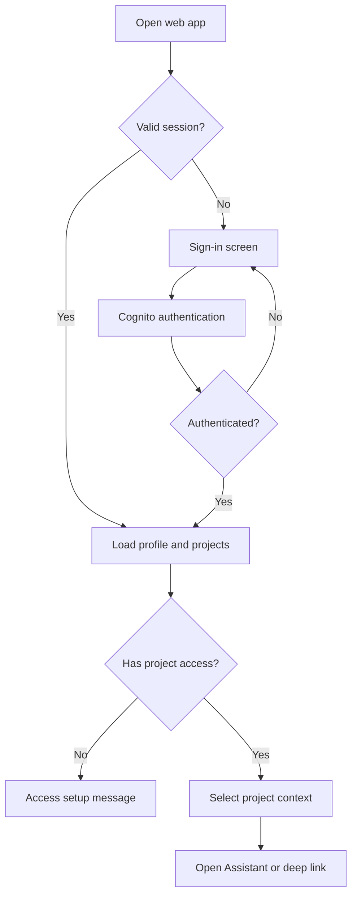
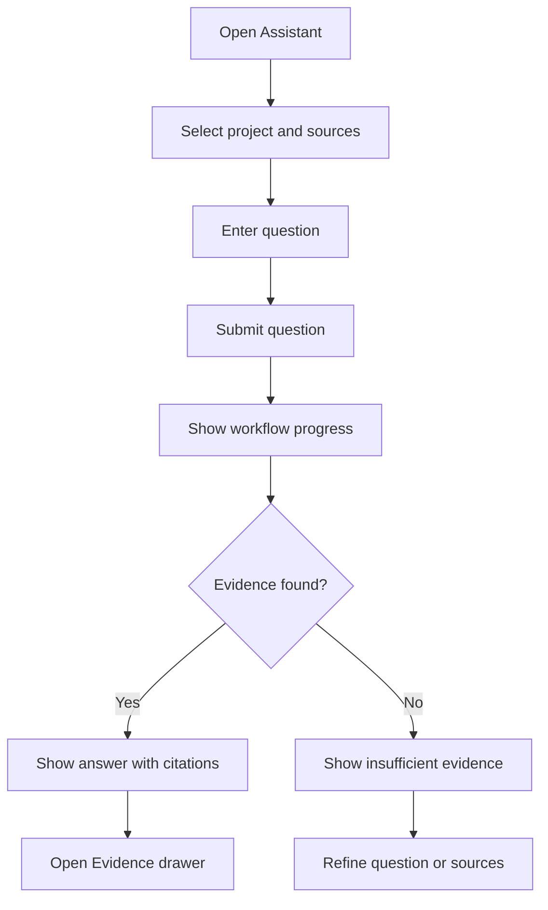
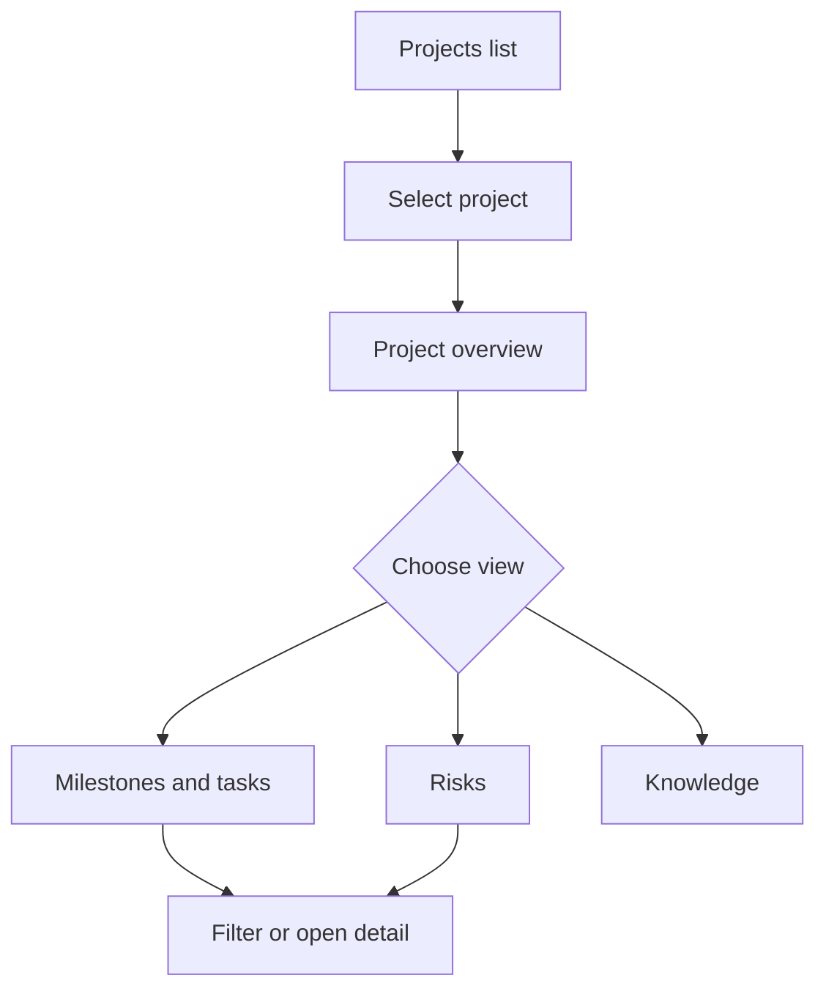
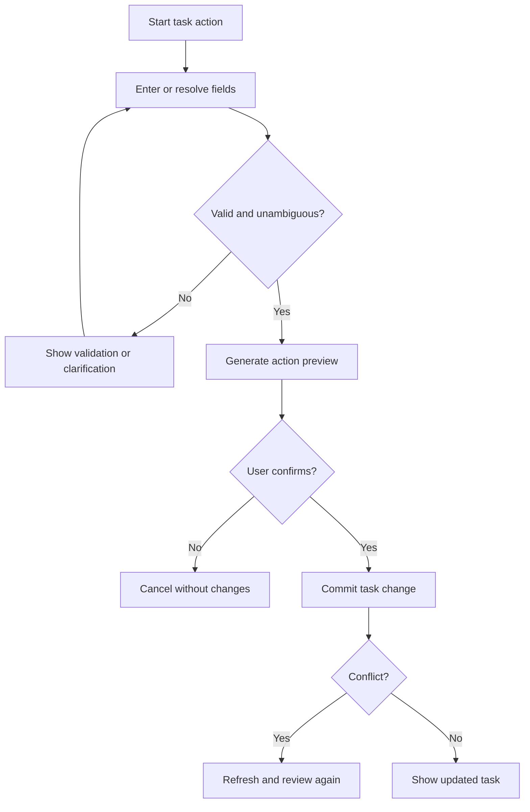
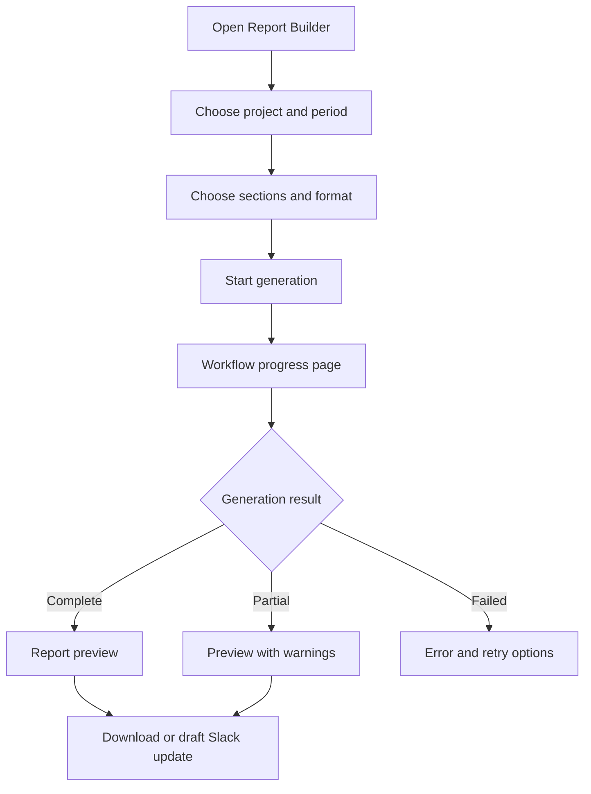
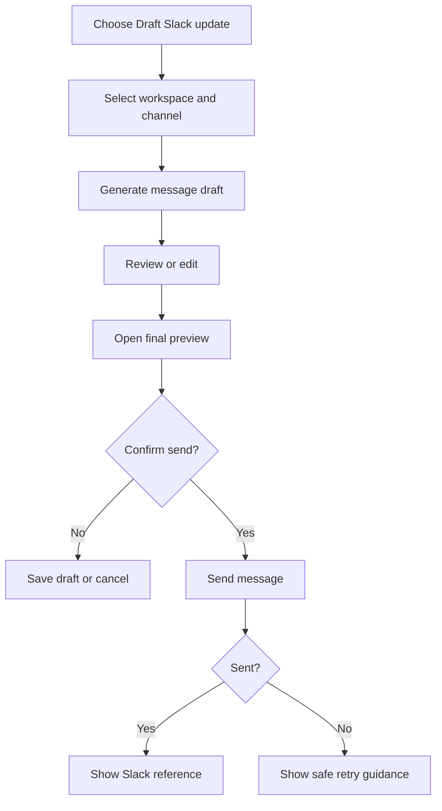
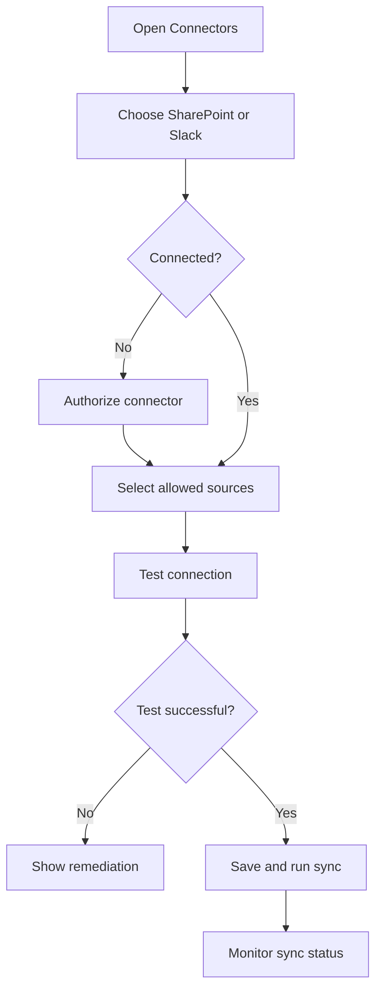
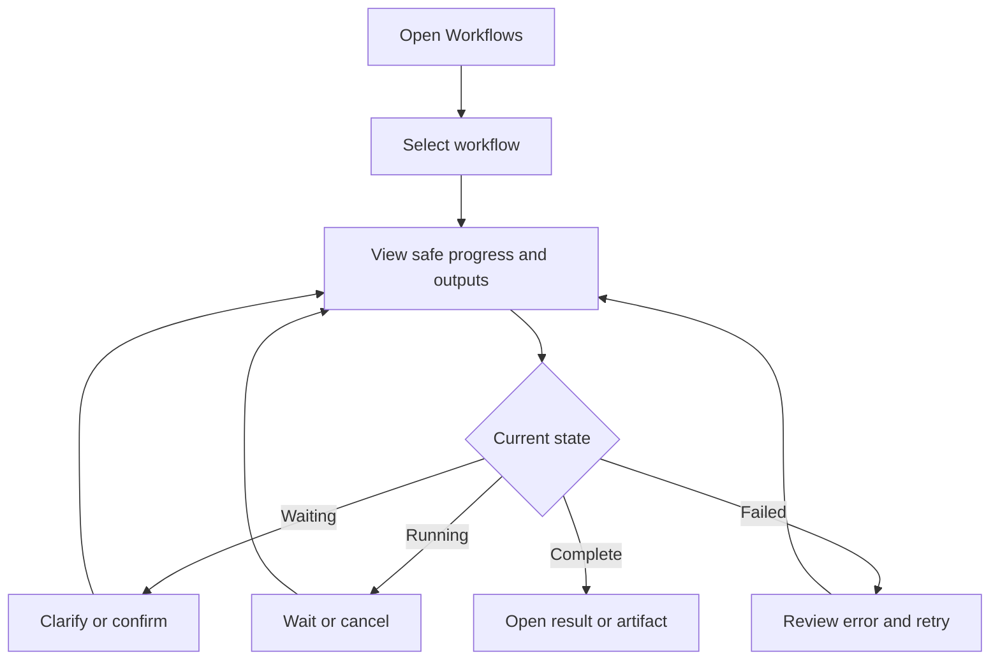

# NPO AI Platform — Web User Flows

> Tài liệu này mô tả user flow của ứng dụng web dựa trên các use case trong `requirements.md`. Trọng tâm là trải nghiệm người dùng, cấu trúc màn hình, điều hướng, thao tác, trạng thái giao diện và API contract mà frontend cần sử dụng. Chi tiết triển khai agent và hạ tầng không thuộc phạm vi của tài liệu này.

## 1. Mục tiêu của web application

Web application giúp nhân sự NPO:

- Hỏi đáp trên tài liệu nội bộ và xem nguồn trích dẫn.
- Theo dõi project, milestone, task, owner và risk.
- Tạo hoặc cập nhật task có bước xác nhận.
- Tạo weekly report và risk summary.
- Soạn, duyệt và gửi cập nhật lên Slack.
- Theo dõi tiến trình của workflow nhiều agent.
- Quản trị kết nối SharePoint và Slack nếu có quyền.

## 2. Nhóm người dùng

| Persona | Nhu cầu chính | Khu vực web được truy cập |
|---|---|---|
| NPO Staff | Tìm kiếm kiến thức, xem task được giao | Assistant, Projects, My Tasks, Workflows |
| Project Manager | Theo dõi project, quản lý task, tạo report, gửi update | Toàn bộ khu vực vận hành project |
| Program Director | Xem nhiều project và báo cáo tổng hợp | Portfolio, Projects, Reports, Workflows |
| Knowledge Administrator | Quản lý nguồn dữ liệu và trạng thái đồng bộ | Connectors, Knowledge Sources |
| Auditor | Xem dữ liệu và lịch sử workflow ở chế độ read-only | Projects, Reports, Workflows, Audit views |
| Platform Administrator | Quản lý cấu hình kỹ thuật | System settings; không mặc định có quyền đọc business data |

## 3. Information architecture

### 3.1 Route map

```text
/
├── /login
├── /auth/callback
└── /app
    ├── /assistant
    ├── /projects
    │   └── /:projectId
    │       ├── /overview
    │       ├── /tasks
    │       ├── /risks
    │       ├── /knowledge
    │       └── /reports
    ├── /my-tasks
    ├── /reports
    │   └── /:reportId
    ├── /workflows
    │   └── /:workflowId
    ├── /admin/connectors
    │   └── /:connectorId
    ├── /settings/profile
    └── /forbidden
```

### 3.2 Primary navigation

Desktop sidebar:

1. Assistant
2. Projects
3. My Tasks
4. Reports
5. Workflows
6. Connectors — chỉ hiển thị cho Knowledge Administrator
7. Settings

Mobile navigation:

- Assistant
- Projects
- Tasks
- More

Các menu không có quyền phải được ẩn. Backend vẫn phải kiểm tra quyền đối với mọi route và API; việc ẩn menu không phải authorization control.

## 4. Global application shell

Mọi trang bên trong `/app` sử dụng cùng một application shell.

### 4.1 Header

- Logo và tên tổ chức.
- Project context selector.
- Global search/“Ask AI” shortcut.
- Notification indicator cho workflow cần xác nhận.
- User menu: profile, role đang sử dụng, sign out.

### 4.2 Sidebar

- Navigation theo role.
- Trạng thái thu gọn/mở rộng.
- Badge số workflow đang chạy hoặc chờ người dùng.

### 4.3 Global feedback

- Toast: thao tác ngắn như lưu filter, copy link.
- Inline alert: lỗi liên quan nội dung của trang.
- Confirmation modal: mọi side effect quan trọng.
- Workflow drawer: tác vụ agent chạy lâu.
- Full-page error: session hết hạn, mất kết nối hoặc trang không có quyền.

### 4.4 Trạng thái chuẩn

Mỗi màn hình dữ liệu phải có:

- `initial-loading`: skeleton, không dùng spinner toàn trang nếu có thể.
- `refreshing`: giữ dữ liệu cũ và hiển thị trạng thái cập nhật.
- `empty`: giải thích vì sao chưa có dữ liệu và đưa ra hành động tiếp theo.
- `error-retryable`: thông báo ngắn và nút Retry.
- `error-blocking`: hướng dẫn người dùng hoặc liên hệ admin.
- `forbidden`: không tiết lộ dữ liệu hoặc tên tài nguyên bị hạn chế.
- `offline`: giữ bản xem gần nhất nếu an toàn và vô hiệu hóa mutation.
- `success`: xác nhận rõ kết quả và liên kết tới entity/workflow liên quan.

## 5. Shared web components

| Component | Mục đích |
|---|---|
| `ProjectContextSelector` | Chọn project được phép truy cập |
| `AssistantComposer` | Nhập câu hỏi, đính kèm context và chọn source |
| `AssistantAnswer` | Hiển thị câu trả lời, warning và action suggestions |
| `CitationList` | Danh sách citations đánh số |
| `EvidenceDrawer` | Xem metadata và đoạn trích của nguồn |
| `WorkflowProgress` | Hiển thị tiến trình an toàn, không hiện chain-of-thought |
| `TaskTable` | Danh sách task có sort, filter, pagination |
| `RiskTable` | Danh sách risk theo severity/status |
| `EntityPicker` | Chọn project, user, channel từ danh sách được phép |
| `ActionPreviewModal` | Hiển thị before/after trước mutation |
| `ReportBuilder` | Chọn loại report, thời gian và sections |
| `ReportViewer` | Xem report và citations |
| `SlackMessagePreview` | Xem channel và nội dung trước khi gửi |
| `ConnectorCard` | Hiển thị trạng thái kết nối và sync |
| `EmptyState` | Empty state thống nhất theo từng domain |
| `PermissionBoundary` | Bảo vệ component theo capability từ backend |

## 6. WF-00 — Đăng nhập và chọn project context

### 6.1 Mục tiêu

Đưa người dùng từ trạng thái chưa đăng nhập vào workspace phù hợp với role và project mà họ được phép truy cập.

### 6.2 Entry points

- Người dùng mở URL gốc.
- Người dùng mở deep link đến report, workflow hoặc project.
- Session cũ hết hạn và ứng dụng chuyển về login.

### 6.3 Flow diagram



### 6.4 Main flow

1. Web app kiểm tra session.
2. Nếu chưa đăng nhập, hiển thị trang Login với nút “Sign in”.
3. Người dùng đăng nhập qua Cognito Hosted UI hoặc Amplify Auth.
4. Sau callback, frontend gọi `GET /v1/me`.
5. Frontend nhận profile, roles, capabilities và danh sách project được phép truy cập.
6. Nếu chỉ có một project, tự động chọn project đó.
7. Nếu có nhiều project, hiển thị `ProjectContextSelector`.
8. Nếu người dùng đến từ deep link và có quyền, mở lại đúng màn hình.
9. Nếu không có deep link, mở `/app/assistant`.

### 6.5 Screen requirements

#### Login screen

- Logo và tên hệ thống.
- Nút Sign in.
- Privacy notice ngắn.
- Không hiển thị form tenant ID cho người dùng tự nhập.
- Lỗi đăng nhập không được tiết lộ thông tin nội bộ của Cognito.

#### Project selection

- Hiển thị project name, program name và trạng thái.
- Search khi danh sách lớn hơn 10 project.
- Không hiển thị project không được phép.
- Ghi nhớ lựa chọn gần nhất theo user nhưng phải xác nhận lại bằng backend.

### 6.6 Alternate flows

- Token hết hạn: lưu URL hiện tại, chuyển tới login, sau đó quay lại deep link.
- User chưa được provision: hiển thị “Your account needs access setup”.
- Deep link không có quyền: chuyển `/app/forbidden`, không hiển thị tên hoặc metadata của tài nguyên.
- Không tải được profile: hiển thị Retry và Sign out.

### 6.7 API mapping

| Action | API |
|---|---|
| Load profile and capabilities | `GET /v1/me` |
| Sign out | Cognito sign-out flow |

### 6.8 Acceptance criteria

- Không thể truy cập `/app/*` nếu chưa đăng nhập.
- Refresh trang không làm mất deep link.
- Project selector chỉ chứa project được backend trả về.
- Menu và action thay đổi đúng theo capabilities.

## 7. WF-01 — Hỏi đáp kiến thức và xem citation

### 7.1 Use case liên quan

UC-01 — Knowledge question with citations.

### 7.2 Entry points

- `/app/assistant`.
- Nút “Ask AI” trên project overview.
- Tab Knowledge của project.
- Shortcut hỏi về một task, risk hoặc report đang mở.

### 7.3 Flow diagram



### 7.4 Assistant screen layout

- Left/center: conversation timeline.
- Bottom: `AssistantComposer`.
- Right drawer: Sources/Evidence, collapsed by default trên màn hình nhỏ.
- Top context bar: selected project và source filters.

### 7.5 Composer fields

- Question textarea.
- Project context — required.
- Sources:
  - All approved sources.
  - Google Drive.
  - SharePoint.
  - Slack.
- Submit button.
- Stop button khi workflow đang chạy.
- Suggested prompts theo project.

Không hỗ trợ upload file trong MVP nếu file upload chưa có pipeline kiểm tra ACL và malware.

### 7.6 Main flow

1. Người dùng mở Assistant.
2. Project context được lấy từ global selector hoặc route.
3. Người dùng có thể giữ “All approved sources” hoặc chọn source cụ thể.
4. Người dùng nhập câu hỏi.
5. Frontend validate câu hỏi không rỗng và không vượt giới hạn ký tự.
6. Frontend gọi `POST /v1/chat`.
7. Tin nhắn của người dùng xuất hiện ngay với trạng thái `sending`.
8. UI hiển thị safe progress:
   - Understanding request.
   - Searching approved sources.
   - Verifying evidence.
9. Nếu API trả workflow async, frontend poll workflow.
10. Khi hoàn tất, hiển thị:
    - Câu trả lời.
    - Warning nếu có.
    - Citation chips `[1]`, `[2]`.
    - Source coverage: Drive, SharePoint, Slack.
    - Thời điểm dữ liệu được cập nhật.
11. Người dùng bấm citation để mở `EvidenceDrawer`.
12. Drawer hiển thị document title, source, section/page, last modified và đoạn trích được phép.
13. Người dùng có thể Copy answer, Copy citation hoặc Ask follow-up.

### 7.7 Answer states

| State | UI behavior |
|---|---|
| Complete | Answer và citations đầy đủ |
| Partial | Banner vàng, nêu source nào không khả dụng |
| Insufficient evidence | Không tạo câu trả lời khẳng định; gợi ý refine query |
| Conflicting evidence | Hiển thị từng kết luận cùng nguồn và timestamp |
| Forbidden | Thông báo không có quyền, không tiết lộ nội dung nguồn |
| Failed | Giữ câu hỏi, cho phép Retry với cùng idempotency key |
| Cancelled | Hiển thị đã dừng; không tự động tiếp tục |

### 7.8 Citation interaction

- Citation number trong answer phải map chính xác tới một citation record.
- Hover có thể hiển thị title/source; click mở drawer.
- Source link chỉ xuất hiện nếu backend xác nhận người dùng được phép mở.
- Nếu source link hết hạn, frontend request link mới thay vì lưu lâu dài.
- Nếu citation không còn khả dụng, hiển thị metadata và trạng thái “Source unavailable”.

### 7.9 Alternate flows

- Không chọn project: mở project selector trước khi submit.
- Câu hỏi mơ hồ: Assistant hiển thị clarification card với 2–5 lựa chọn và ô nhập khác.
- Source được chọn đang tắt: hiển thị warning trước submit hoặc kết quả partial.
- Session hết hạn trong khi chờ: chuyển login nhưng giữ draft cục bộ.

### 7.10 API mapping

| Action | API |
|---|---|
| Submit bounded question | `POST /v1/chat` |
| Submit long/complex question | `POST /v1/workflows` |
| Poll progress | `GET /v1/workflows/{workflowId}` |
| Submit clarification | `POST /v1/workflows/{workflowId}/confirm` |
| Stop workflow | `POST /v1/workflows/{workflowId}/cancel` |
| Open citation | `GET /v1/citations/{citationId}` |

### 7.11 Acceptance criteria

- Người dùng luôn thấy project context trước khi gửi.
- Answer dùng knowledge phải hiển thị citation.
- Không evidence phải có empty-answer state riêng.
- Citation drawer hoạt động bằng keyboard và mobile.
- Refresh trong workflow async có thể khôi phục tiến trình.

## 8. WF-02 — Xem project status, milestone, task và risk

### 8.1 Use case liên quan

UC-02 — Project and task status.

### 8.2 Entry points

- `/app/projects`.
- Project card từ Assistant answer.
- Global project selector → “Open project”.

### 8.3 Flow diagram



### 8.4 Projects list

Hiển thị:

- Project name.
- Program.
- Status.
- Project Manager.
- Next milestone.
- Overdue task count.
- Open high-risk count.
- Last updated.

Controls:

- Search by project name.
- Filter by status/program/manager.
- Sort by last updated, deadline hoặc risk.
- Card/table view tùy viewport.

### 8.5 Project overview

Sections:

1. Summary header: status, owner, date range.
2. KPI cards: completed/open/overdue tasks, open risks, milestone health.
3. Upcoming milestones.
4. Overdue tasks.
5. Top risks.
6. Recent reports.
7. “Ask about this project” action.

### 8.6 Main flow

1. Người dùng mở Projects.
2. Frontend tải danh sách được phép.
3. Người dùng search/filter và chọn một project.
4. Frontend mở `/app/projects/:projectId/overview`.
5. Overview hiển thị skeleton theo từng widget.
6. Widget lỗi không làm hỏng toàn bộ trang; hiển thị Retry tại widget.
7. Người dùng chuyển tab Tasks hoặc Risks.
8. Task table cho phép filter:
   - Status.
   - Owner.
   - Due date.
   - Overdue only.
9. Risk table cho phép filter severity, owner và status.
10. Người dùng mở task/risk detail drawer mà không mất filter hiện tại.

### 8.7 Empty and error states

- No projects: giải thích user chưa được gán project.
- No tasks match filter: nút Clear filters.
- No overdue tasks: positive empty state, không hiển thị lỗi.
- Project forbidden/not found: generic unavailable page.
- Partial widget failure: giữ các widget thành công.

### 8.8 API requirements

Frontend cần các read endpoints hoặc một aggregate project endpoint do backend cung cấp:

```text
GET /v1/projects
GET /v1/projects/{projectId}
GET /v1/projects/{projectId}/tasks
GET /v1/projects/{projectId}/risks
GET /v1/projects/{projectId}/milestones
```

Mỗi list endpoint cần hỗ trợ opaque cursor, filter và sort allowlist.

### 8.9 Acceptance criteria

- Filter được lưu trong URL query để refresh/back hoạt động.
- Table hỗ trợ loading, empty, pagination và retry.
- Dữ liệu luôn hiển thị `last updated` hoặc `data as of`.
- Auditor không nhìn thấy Create/Edit actions.

## 9. WF-03 — Tạo hoặc cập nhật task

### 9.1 Use case liên quan

UC-03 — Create or update a task.

### 9.2 Entry points

- Nút “Create task” trong project Tasks tab.
- Edit action trong task detail.
- Assistant request bằng ngôn ngữ tự nhiên.
- Suggested action từ report/risk.

### 9.3 Flow diagram



### 9.4 Task form

Fields:

- Project — fixed when entered from project page.
- Task title — required.
- Description.
- Assignee — searchable `EntityPicker`, only authorized project members.
- Status.
- Priority.
- Due date and timezone.
- Related milestone.
- Related risk.

### 9.5 Main flow from form

1. User bấm Create task hoặc Edit.
2. Web mở drawer/modal hoặc dedicated route trên mobile.
3. User nhập/chỉnh sửa fields.
4. Client-side validation hỗ trợ UX nhưng không thay backend validation.
5. User bấm Review changes.
6. Frontend gửi dry-run proposal.
7. `ActionPreviewModal` hiển thị:
   - Project.
   - Task title.
   - Before/after fields.
   - Assignee.
   - Due date với timezone.
8. User chọn Back, Cancel hoặc Confirm.
9. Khi Confirm, button chuyển sang loading và bị disable để tránh double click.
10. Backend commit thành công.
11. UI đóng modal, cập nhật task table và hiển thị success toast có link tới task.

### 9.6 Main flow from Assistant

1. User yêu cầu tạo/update task bằng text.
2. Assistant hiển thị clarification card nếu thiếu project, task, assignee hoặc date.
3. Khi đủ dữ liệu, Assistant hiển thị cùng `ActionPreviewModal` như form flow.
4. Việc Confirm sử dụng cùng API và confirmation rule; không tạo một mutation path riêng cho chat.

### 9.7 Conflict and safety states

- Multiple assignees match: show choices with display name và project role.
- Ambiguous date: show resolved absolute date before preview.
- Record changed: show conflict comparison and nút “Review latest version”.
- Confirmation expired: regenerate preview.
- Permission revoked: close edit mode, show permission error, reload task read-only.
- Network timeout after confirm: không tự gửi lại với key mới; query workflow/result bằng idempotency key.

### 9.8 API mapping

```text
POST /v1/projects/{projectId}/tasks/proposals
POST /v1/workflows/{workflowId}/confirm
POST /v1/workflows/{workflowId}/cancel
GET  /v1/workflows/{workflowId}
```

### 9.9 Acceptance criteria

- Không có write trước confirmation.
- Preview phải hiển thị exact before/after.
- Double click hoặc retry không tạo duplicate task.
- User không có capability `task:write` không thấy action và backend trả `403` nếu gọi trực tiếp.

## 10. WF-04 — Tạo weekly report và risk summary

### 10.1 Use case liên quan

UC-04 — Weekly report and risk summary.

### 10.2 Entry points

- Nút “Generate report” trên Project Overview.
- `/app/reports` → New report.
- Assistant prompt.

### 10.3 Flow diagram



### 10.4 Report builder fields

- Project — required.
- Report type:
  - Weekly status.
  - Risk summary.
  - Management update.
  - Donor report draft.
- Reporting period.
- Included sections.
- Sources: project data, Drive, SharePoint, Slack.
- Output format: web preview và Markdown; PDF có thể là phase sau.
- Additional instructions với giới hạn ký tự.

### 10.5 Main flow

1. User mở Report Builder.
2. Default period là tuần hiện tại theo organization timezone.
3. User chọn sections và sources.
4. User bấm Generate report.
5. Frontend gọi `POST /v1/workflows` và điều hướng tới `/app/workflows/:id` hoặc mở progress drawer.
6. Progress UI hiển thị các phase ở mức user-facing:
   - Collecting project data.
   - Searching approved evidence.
   - Preparing risk summary.
   - Drafting report.
7. Không hiển thị tên model, prompt hoặc chain-of-thought.
8. Khi hoàn tất, frontend điều hướng `/app/reports/:reportId`.
9. Report Viewer hiển thị:
   - Report status/version.
   - Period và project.
   - Generated sections.
   - Inline citation markers.
   - Evidence drawer.
   - Warnings/conflicts.
10. User có thể Download, Copy, Regenerate hoặc Draft Slack update.

### 10.6 Partial report UX

- Banner vàng ở đầu report.
- Nêu section hoặc source không khả dụng.
- Những phần thiếu dùng placeholder rõ ràng, không được tự bịa.
- Cho phép retry riêng phần bị lỗi nếu backend hỗ trợ.
- Không dùng label “Complete” cho report partial.

### 10.7 Cancel flow

1. User bấm Cancel generation.
2. Modal giải thích phần đang chạy sẽ dừng nếu có thể.
3. User xác nhận cancel.
4. UI giữ workflow record với status Cancelled.
5. Không hiển thị report draft chưa hoàn thiện như report chính thức.

### 10.8 API mapping

| Action | API |
|---|---|
| Create report workflow | `POST /v1/workflows` |
| Poll progress | `GET /v1/workflows/{workflowId}` |
| Cancel | `POST /v1/workflows/{workflowId}/cancel` |
| Retry failed branch | `POST /v1/workflows/{workflowId}/retry` |
| Open report | `GET /v1/reports/{reportId}` |
| Open citation | `GET /v1/citations/{citationId}` |

### 10.9 Acceptance criteria

- Report generation không block browser request dài.
- Refresh hoặc mở ở tab khác vẫn xem được progress.
- Report partial được phân biệt rõ với complete.
- Citation trong report mở đúng Evidence drawer.

## 11. WF-05 — Soạn, duyệt và gửi Slack update

### 11.1 Use case liên quan

UC-05 — Draft and send Slack update.

### 11.2 Entry points

- Report Viewer → “Draft Slack update”.
- Project Overview → “Share update”.
- Assistant prompt.

### 11.3 Flow diagram



### 11.4 Slack composer

Fields:

- Workspace — fixed or selected from allowlist.
- Channel — searchable allowlisted channels.
- Source report/project.
- Message content.
- Optional mention controls nếu được policy cho phép.

### 11.5 Main flow

1. User chọn Draft Slack update.
2. UI preselect project và source report.
3. User chọn workspace/channel.
4. Frontend yêu cầu tạo draft.
5. Draft hiển thị trong `SlackMessagePreview`.
6. User edit message nếu role cho phép.
7. Khi nội dung thay đổi, mọi confirmation cũ bị vô hiệu hóa.
8. User bấm Review and send.
9. Final confirmation modal hiển thị:
   - Workspace.
   - Channel name và ID rút gọn.
   - Exact message.
   - Người gửi/bot identity.
10. User bấm Confirm send.
11. UI lock modal, hiển thị sending.
12. Thành công: hiển thị timestamp, channel và Open in Slack nếu backend trả URL được phép.

### 11.6 Error states

- Channel ambiguous: show picker; không đoán.
- Bot not in channel: hướng dẫn admin/add bot.
- OAuth expired: show “Reconnect required” cho admin; normal user chỉ thấy connector unavailable.
- Rate limited: hiển thị thời gian dự kiến retry.
- Unknown result after timeout: status “Checking delivery”; không tự gửi duplicate.
- Permission changed: stop send và giữ draft read-only.

### 11.7 API requirements

```text
POST /v1/slack/drafts
POST /v1/workflows/{workflowId}/confirm
GET  /v1/workflows/{workflowId}
```

### 11.8 Acceptance criteria

- Exact message/channel phải được confirm.
- Edit draft bắt buộc confirm lại.
- UI không cho double-submit.
- Kết quả không chắc chắn không được hiển thị là Sent.

## 12. WF-06 — Quản trị SharePoint và Slack connectors

### 12.1 Use case liên quan

UC-06 — Ingest SharePoint and Slack data to S3.

### 12.2 Primary user

Knowledge Administrator.

### 12.3 Entry point

`/app/admin/connectors`.

### 12.4 Flow diagram



### 12.5 Connector list

Mỗi `ConnectorCard` hiển thị:

- Provider icon/name.
- Connected account/workspace/site metadata an toàn.
- Status: Not configured, Authorization required, Healthy, Syncing, Degraded, Failed, Disabled.
- Last successful sync.
- Last attempted sync.
- Documents processed/quarantined.
- Next scheduled sync.
- Actions theo capability.

Không hiển thị access token, refresh token, secret ARN hoặc raw provider error.

### 12.6 Connect flow

1. Admin bấm Connect trên SharePoint hoặc Slack card.
2. Web hiển thị permissions summary trước redirect.
3. Admin tiếp tục tới provider OAuth.
4. Sau callback, web trở lại connector setup.
5. Admin chọn allowed sites/drives hoặc workspaces/channels.
6. Admin map source tới tenant/project.
7. Admin cấu hình lịch sync và retention.
8. Admin bấm Test connection.
9. Nếu test thành công, admin bấm Save.
10. UI hỏi có muốn Run first sync hay không.

### 12.7 Manual sync flow

1. Admin bấm Sync now.
2. UI hiển thị confirmation với source scope.
3. Backend tạo sync execution.
4. Card chuyển trạng thái Syncing.
5. UI poll status và hiển thị counts.
6. Kết thúc:
   - Healthy: last successful sync cập nhật.
   - Degraded: có items quarantined hoặc một page lỗi.
   - Failed: không có batch usable hoặc authorization lỗi.
7. Admin có thể mở sync detail để xem safe errors và retry.

### 12.8 Disconnect flow

1. Admin bấm Disconnect.
2. Modal giải thích:
   - Ngừng sync mới.
   - Xử lý dữ liệu đã ingest theo retention policy.
   - Không tự động xóa toàn bộ dữ liệu nếu không có policy rõ ràng.
3. Admin nhập/confirm connector name nếu destructive impact cao.
4. Backend revoke/disable connector.
5. UI cập nhật status Disabled hoặc Authorization required.

### 12.9 API mapping

```text
GET  /v1/admin/connectors
POST /v1/admin/connectors/{type}/authorize
GET  /v1/admin/connectors/{type}/callback
PUT  /v1/admin/connectors/{connectorId}
POST /v1/admin/connectors/{connectorId}/test
POST /v1/admin/connectors/{connectorId}/sync
GET  /v1/admin/connectors/{connectorId}/syncs/{syncId}
POST /v1/admin/connectors/{connectorId}/disable
```

### 12.10 Acceptance criteria

- Non-admin không thấy menu và bị backend từ chối nếu gọi API.
- OAuth callback không đưa token vào URL application.
- Admin luôn thấy last sync, status và remediation.
- Connector lỗi không làm hỏng Assistant UI; Assistant chỉ báo source unavailable.

## 13. WF-07 — Xem, tiếp tục, retry hoặc cancel workflow

### 13.1 Use case liên quan

UC-07 — Workflow inspection.

### 13.2 Entry points

- `/app/workflows`.
- Workflow drawer.
- Deep link từ Assistant, Report hoặc notification.

### 13.3 Workflow list

Columns/cards:

- Request summary.
- Project.
- Created by.
- Created at.
- Status.
- Progress summary.
- Requires action badge.
- Duration.

Filters:

- Status.
- Project.
- Created by me.
- Date range.
- Needs my action.

### 13.4 Flow diagram



### 13.5 Workflow detail

Hiển thị:

- User request summary.
- Project context.
- Public status.
- Safe progress timeline.
- Completed outputs.
- Warnings/errors.
- Citations/artifacts.
- Approval or clarification card nếu cần.
- Cancel/Retry actions theo trạng thái và quyền.

Không hiển thị:

- Chain-of-thought.
- System prompt.
- Raw model request/response.
- Credentials hoặc authorization headers.
- Internal AWS ARNs không cần thiết.

### 13.6 Resume clarification flow

1. Workflow detail hiển thị câu hỏi clarification.
2. Nếu backend cung cấp choices, render radio/select.
3. Nếu cần text, render input có validation.
4. User submit.
5. Card chuyển trạng thái Submitted.
6. Workflow tiếp tục polling.

### 13.7 Approval flow

1. Workflow detail hiển thị exact action preview.
2. User chọn Reject hoặc Confirm.
3. Confirm button yêu cầu final acknowledgment.
4. Sau submit, card bị lock.
5. Workflow chuyển Running rồi Complete/Failed.

### 13.8 Retry flow

1. Chỉ hiển thị Retry nếu backend đánh dấu `retryable=true` và user có quyền.
2. UI mô tả phần sẽ retry.
3. User confirm retry.
4. Timeline thêm attempt mới; không xóa attempt cũ.
5. Mutation đã commit không được chạy lại.

### 13.9 Cancel flow

1. Chỉ hiển thị Cancel cho Queued, Planning, Running hoặc Waiting.
2. Confirmation modal giải thích tác vụ đã hoàn thành không được rollback tự động.
3. Sau cancel, UI chuyển Cancel requested rồi Cancelled.
4. Nếu workflow vừa hoàn tất, hiển thị Completed và thông báo cancel không còn áp dụng.

### 13.10 API mapping

```text
GET  /v1/workflows
GET  /v1/workflows/{workflowId}
POST /v1/workflows/{workflowId}/confirm
POST /v1/workflows/{workflowId}/retry
POST /v1/workflows/{workflowId}/cancel
```

### 13.11 Acceptance criteria

- Refresh/deep link giữ nguyên workflow detail.
- Waiting workflow có badge trong navigation.
- Timeline chỉ hiển thị safe events.
- Retry giữ lịch sử attempt trước.

## 14. WF-08 — Xử lý unauthorized, unsafe và unsupported request

### 14.1 Unauthorized

- Route-level: chuyển tới `/app/forbidden`.
- Component-level: ẩn action nhưng vẫn render read-only content nếu có quyền đọc.
- API `403`: hiển thị generic permission message.
- Cross-tenant/not found: không tiết lộ entity tồn tại.

### 14.2 Unsafe action

Nếu user yêu cầu:

- Xóa dữ liệu hàng loạt.
- Thay đổi permissions.
- Thực hiện financial/HR/legal decision.
- Gửi external communication không xác nhận.
- Bypass approval.

Assistant phải hiển thị policy-boundary response và chỉ đề xuất hành động an toàn như tạo draft hoặc liên hệ người có thẩm quyền.

### 14.3 Unsupported request

- Nêu ngắn gọn capability hiện tại.
- Đưa ra 1–3 hành động thay thế.
- Không hiển thị generic stack trace hoặc model error.

### 14.4 Ambiguous request

Sử dụng clarification card:

- Một câu hỏi tại một thời điểm nếu có thể.
- 2–5 lựa chọn được phép.
- Có lựa chọn nhập tự do khi phù hợp.
- Giữ nguyên context trước đó.
- Có Cancel.

## 15. Responsive behavior

### Desktop

- Sidebar cố định.
- Conversation và Evidence drawer có thể hiển thị song song.
- Project tables sử dụng full columns.

### Tablet

- Sidebar thu gọn.
- Evidence hiển thị drawer overlay.
- Tables ẩn cột ít quan trọng.

### Mobile

- Bottom navigation.
- Assistant composer sticky bottom.
- Evidence mở full-screen sheet.
- Form/modal phức tạp chuyển thành dedicated full-screen route.
- Task/report tables chuyển thành card list.
- Confirmation phải giữ exact action details, không rút gọn tới mức mất thông tin quan trọng.

## 16. Accessibility requirements

- Đáp ứng WCAG 2.2 AA cho các flow chính.
- Tất cả control sử dụng được bằng keyboard.
- Focus được đưa vào modal/drawer và trả về trigger khi đóng.
- Không dùng màu sắc là tín hiệu trạng thái duy nhất.
- Loading status sử dụng `aria-live` phù hợp nhưng không đọc liên tục mỗi polling tick.
- Citation chips có accessible name như “Open citation 2: Procurement Policy”.
- Tables có header, caption và accessible sort state.
- Error liên kết tới field tương ứng.
- Confirmation destructive/high-impact không được auto-focus vào Confirm.

## 17. Frontend state and data rules

- Sử dụng server state library như TanStack Query cho API data.
- Query keys phải bao gồm project context và filter.
- Không cache data của tenant/project khác dưới cùng query key.
- Clear sensitive server cache khi sign out hoặc đổi tenant.
- Giữ draft câu hỏi/form cục bộ khi token refresh nhưng không lưu token vào draft.
- Mọi mutation gửi `Idempotency-Key`.
- Không optimistic-update cho action cần confirmation hoặc external send.
- Có thể optimistic-update filter, local draft và non-critical preference.
- Workflow polling phải dừng khi page hidden trong thời gian dài và resume an toàn khi quay lại.

## 18. Analytics and UX events

Chỉ gửi metadata không nhạy cảm:

- `sign_in_completed`
- `project_context_selected`
- `assistant_question_submitted`
- `assistant_answer_completed`
- `citation_opened`
- `task_proposal_created`
- `task_change_confirmed`
- `task_change_rejected`
- `report_generation_started`
- `report_opened`
- `slack_draft_created`
- `slack_send_confirmed`
- `workflow_cancelled`
- `connector_test_completed`
- `connector_sync_started`

Không gửi prompt text, answer text, document excerpt, OAuth data hoặc personal sensitive fields vào analytics.

## 19. Web acceptance test matrix

| Flow | Desktop | Mobile | Keyboard | Permission | Loading/empty/error | Deep link/refresh |
|---|---:|---:|---:|---:|---:|---:|
| WF-00 Authentication | Required | Required | Required | Required | Required | Required |
| WF-01 Knowledge Q&A | Required | Required | Required | Required | Required | Required |
| WF-02 Project status | Required | Required | Required | Required | Required | Required |
| WF-03 Task mutation | Required | Required | Required | Required | Required | Required |
| WF-04 Report generation | Required | Required | Required | Required | Required | Required |
| WF-05 Slack update | Required | Required | Required | Required | Required | Required |
| WF-06 Connectors | Required | Responsive minimum | Required | Required | Required | Required |
| WF-07 Workflow inspection | Required | Required | Required | Required | Required | Required |

## 20. Definition of done for web flows

Web user flows được coi là hoàn thành khi:

1. Các route trong Section 3 hoạt động và được bảo vệ bởi authentication.
2. Navigation và actions phản ánh capabilities từ backend.
3. WF-00 đến WF-07 có happy path chạy end-to-end bằng API thật hoặc contract-compliant mock.
4. Mỗi màn hình có loading, empty, partial, error và forbidden state phù hợp.
5. Assistant hiển thị citations và Evidence drawer.
6. Task mutation có dry-run preview và confirmation.
7. Report async có progress, refresh recovery và partial state.
8. Slack send yêu cầu xác nhận exact message/channel.
9. Connector admin chỉ khả dụng với đúng role.
10. Workflow detail không hiển thị chain-of-thought hoặc dữ liệu nội bộ.
11. Responsive behavior được kiểm thử trên desktop, tablet và mobile.
12. Các flow chính đạt accessibility requirements.
13. Không mutation nào bị duplicate khi double click, refresh hoặc network retry.
14. Automated tests bao phủ happy path, permission denial và critical error states của từng flow.

